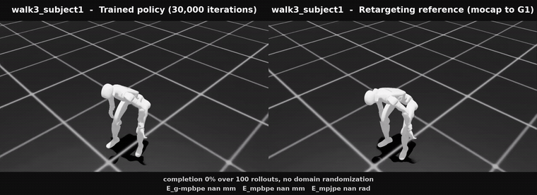
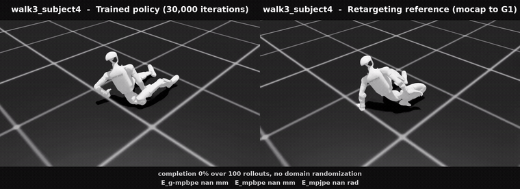
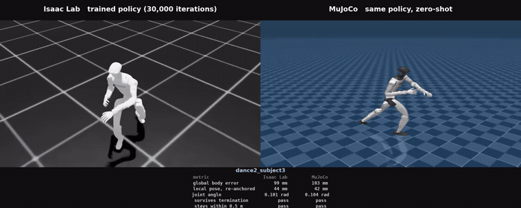
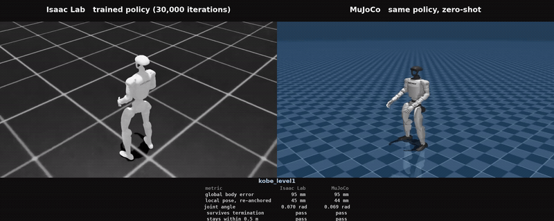

# g1-motion-tracking

Human mocap retargeting and whole-body motion tracking pipeline for the Unitree G1.

Simulation only. Real-robot deployment is out of scope for now.

Why it exists: while building a swarm humanoid simulation, GEAR-SONIC from
NVIDIA's [GR00T Whole-Body Control](https://github.com/NVlabs/GR00T-WholeBodyControl)
was used to drive the G1. Using a controller and building one teach different
things, so this pipeline was built end to end to build whole-body control
directly. SONIC also tracks a reference motion, so this is the same problem
solved by a different hand.

한국어 문서는 [README.md](README.md)를 참고하십시오.

Trained policies and evaluation results: [Hugging Face](https://huggingface.co/hooneyskywalker/g1-motion-tracking-policies)

All videos: [YouTube playlist](https://www.youtube.com/playlist?list=PLLNhmCfT2kPI)

---

## Pipeline


Stages 1 to 3 carry no physics: they compute poses and decide which ones are
worth keeping. Physics enters at stage 4, where the robot has to hold itself up.

### 1. Human mocap

Motion capture records where every joint of a human body was at each instant,
as numbers rather than video.

Done: LAFAN1, 77 BVH sequences at 30 fps, five subjects, 4.6 hours.

### 2. Retargeting

Human joint data cannot be applied to the G1 directly: link lengths differ,
joint axes differ, and some human joints have no robot counterpart. Retargeting
solves for the robot joint angles that best reproduce the original motion while
respecting the robot's joint limits and keeping the feet on the ground.


Orange is the source human skeleton straight out of the mocap file; grey is the
retargeted G1. The bands carry the segment lengths that make this hard and the
distance between each tracked body and the target the IK was solving for. The
robot is not walking here — each frame's joint angles are written straight into
the model and rendered. No simulation step runs.

Done: all 77 sequences retargeted with
[GMR](https://github.com/YanjieZe/GMR), 496,672 frames. Verified across every
frame: no NaNs or infinities, no joint-limit violations on any of the 29 joints,
frame counts matching the source BVH exactly.

### 3. Reference motion

The retargeted trajectory becomes the target the robot is asked to follow.
At this point nothing is physically simulated yet — only the goal exists.

Not every retargeted sequence is worth training on. The measure used here is how
far each tracked body ends up from the target GMR's IK was solving for. Only
pelvis, ankles and wrists are read: torso, shoulder and hip carry position
weights of 0 to 5, and their MuJoCo body origins do not coincide with the human
joint centres, so the constant offset there is not error.

Foot error by motion type, in cm:

```
walk         12 seqs  1.00      obstacles      17 seqs  1.65
dance         8 seqs  1.25      sprint          2 seqs  1.67
aiming        5 seqs  1.27      fallAndGetUp    6 seqs  2.11
run           4 seqs  1.33      ground          5 seqs  2.76
```

Walking is cleanest and floor work is worst, by a factor of three. Falling and
lying down put contact on parts other than the feet, which is not what an
ankle-weighted IK is set up for. Hand error stays at 5-9 cm regardless of motion
type — that is the arm-length gap, not a per-motion failure, so it is not used
to filter.

Done: 19 sequences clear all three foot thresholds — mean under 1.2 cm, p95
under 3.5 cm, max under 10 cm. The list is in
[`configs/selected_motions.txt`](configs/selected_motions.txt). Each was
converted to the 50 fps npz BeyondMimic reads, which adds the link velocities
the policy needs, and uploaded to a W&B registry.

The thresholds are not principled. They were picked because they leave 19
sequences, close to the 21 the GMR paper trained on. Once training shows which
sequences fail and where their error sits, the cut can be argued for.

### 4. Motion tracking policy

The robot is trained with reinforcement learning: it is rewarded for staying
close to the reference motion and penalised for drifting away or falling. The
control rule it converges on is the policy. Success is measured by tracking
accuracy, not by whether the walk merely looks plausible.

Training uses [BeyondMimic](https://github.com/HybridRobotics/whole_body_tracking),
the same framework the GMR paper used. It trains one policy per motion, so the
19 sequences mean 19 training runs. 4096 environments, 30000 iterations, PPO.

That repository targets IsaacSim 4.5 and IsaacLab 2.1.0. Running it against the
local IsaacSim 5.1 / IsaacLab 2.3.2 / rsl-rl 3.1.2 needed three interface
fixes, none of which touch the learning itself: `csv_to_npz.py` never leaves its
`while simulation_app.is_running()` loop after saving, which does not end under
`--headless`; `isaaclab.utils.io` no longer exports `dump_pickle`; and rsl-rl 3.x
moved the observation normalizer off the runner and into the policy.

Playing a trained policy back needs two more fixes in the same file,
`scripts/rsl_rl/play.py`. `--motion_file` is only read on the W&B branch, so a
local checkpoint starts with no reference motion, and `get_observations()` now
returns a TensorDict that the existing tuple unpacking splits along the batch
dimension, leaving a one-dimensional observation.

Done: the first policy, walk2_subject4, trained to 30000 iterations in 8 h 38 m
on an RTX 5080.


The gif above is six seconds of it. The whole sequence runs 3 minutes 58
seconds.

### ▶ Full clip (YouTube)

[](https://youtu.be/l1M4y_Nl7oc)

Click the image above to play it on YouTube — https://youtu.be/l1M4y_Nl7oc

Left is the trained policy stepping through physics, right is the reference it
was asked to follow. Both panels are Isaac Sim under the same lighting and
camera, start from the same motion frame, and run the full 11,909 frame
sequence. They never match pixel for pixel: the initial pose is randomised at
every reset, and the left robot has to hold itself up while the right one is
posed frame by frame.

### ▶ Training progression (YouTube)

[](https://youtu.be/qQw8PtmXV9s)

Click the image above to play it on YouTube — https://youtu.be/qQw8PtmXV9s

Five checkpoints of the same run and the reference, played at once on the same
motion, the same start frame and the same camera. Mean reward runs 14.67 at
1,000 iterations, 30.80 at 5,000, 33.49 at 10,000, 36.63 at 20,000 and 36.80 at
30,000, so most of the gain lands early and the later checkpoints separate on
how long they hold rather than on the number.

### ▶ Domain randomization (YouTube)

[](https://youtu.be/d61rKk675qY)

Click the image above to play it on YouTube — https://youtu.be/d61rKk675qY


Six seconds out of it. On the left is the policy running with domain
randomization on, on the right is the reference. A random push lands every 1-3
seconds, and friction, torso centre of mass, joint offsets and the reset pose
are randomized as well.

A push only adds to the torso velocity, so nothing about it is visible on
screen. The moment the value goes in, the contact point is marked, an arrow is
drawn along the push direction, and the added speed is written next to it. The
arrow stays for one second.

With randomization on, the policy can drift off the reference or the episode can
end early. It then restarts from frame 0, so the two sides fall out of phase.
That is part of the result too.

### Evaluation criteria

Policies are measured the way the GMR paper
([arXiv:2510.02252](https://arxiv.org/abs/2510.02252)) measures them. It uses
the same dataset and the same training framework, so the numbers can be placed
side by side.

| metric | meaning |
| --- | --- |
| completion rate | fraction of rollouts that reach the end of the clip without the anchor body's height or orientation passing its threshold |
| E_g-mpbpe | mean body position error in global coordinates (mm) |
| E_mpbpe | mean body position error after aligning on the anchor (mm) |
| E_mpjpe | mean joint angle error (rad) |

`scripts/eval_all.sh` measures, `src/eval_table.py` builds the table. Domain
randomization is off by default and `--randomize` turns it on, matching the way
the paper separates its sim and sim-dr conditions.

17 of the 19 selected sequences were trained to 30,000 iterations and
evaluated over 100 rollouts. Completion rate sits next to foot error, to see
whether retargeting quality predicts whether the policy holds.

| sequence | foot error (cm) | completion | E_g-mpbpe (mm) | E_mpbpe (mm) | E_mpjpe (rad) |
| --- | --- | --- | --- | --- | --- |
| walk4_subject1 | 0.88 | 100% | 60 | 37 | 0.062 |
| walk3_subject2 | 0.99 | 100% | 79 | 34 | 0.071 |
| walk1_subject2 | 1.05 | 100% | 79 | 34 | 0.066 |
| walk3_subject5 | 1.11 | 100% | 85 | 36 | 0.082 |
| aiming1_subject1 | 0.74 | 100% | 89 | 35 | 0.080 |
| walk1_subject5 | 1.12 | 100% | 90 | 34 | 0.069 |
| dance2_subject3 | 0.94 | 100% | 103 | 45 | 0.104 |
| walk2_subject1 | 0.91 | 100% | 114 | 43 | 0.101 |
| walk1_subject1 | 0.80 | 99% | 80 | 34 | 0.066 |
| walk2_subject4 | 0.70 | 99% | 90 | 40 | 0.085 |
| run2_subject4 | 1.12 | 99% | 178 | 47 | 0.111 |
| jumps1_subject1 | 1.10 | 98% | 151 | 42 | 0.104 |
| obstacles3_subject3 | 1.19 | 98% | 162 | 54 | 0.101 |
| walk2_subject3 | 1.15 | 96% | 129 | 50 | 0.104 |
| walk3_subject4 | 0.88 | 0% | - | - | - |
| obstacles2_subject1 | 0.93 | 0% | - | - | - |
| walk3_subject1 | 1.01 | 0% | - | - | - |
| obstacles1_subject1 | 1.07 | not trained |  |  |  |
| obstacles4_subject2 | 1.19 | not trained |  |  |  |

The three sequences at 0% have no completed rollout, so the three metrics are
undefined. Mean tracked length and E_g-mpbpe over all rollouts instead:

| sequence | mean tracked length | E_g-mpbpe over all rollouts (mm) |
| --- | --- | --- |
| walk3_subject4 | 88% (10,862 / 12,330 frames) | 116 |
| walk3_subject1 | 78% (9,606 / 12,330 frames) | 112 |
| obstacles2_subject1 | 18% (2,144 / 12,204 frames) | 368 |

Foot error ranking did not predict policy performance. The three sequences at
0% sit mid-range at 0.88, 0.93 and 1.01 cm, while obstacles3_subject3 at the
high end (1.19 cm) completes 98% of rollouts. walk4_subject1, which has the
lowest E_g-mpbpe at 60 mm, is at 0.88 cm rather than the top of the list.

It is clearer on video. Once a termination condition fires the episode ends and
restarts from frame 0, so on screen the robot snaps back to its initial pose.



walk3_subject1 at 195 s, where the anchor height crosses its threshold.



walk3_subject4 at 218 s, where an ankle or wrist height crosses its threshold.

A 0% completion rate does not mean the policy never follows the reference. It
follows for over three minutes and then catches on one moment. That is what the
78% and 88% mean tracked lengths are describing.

### The three that never finish are a reference problem, not a training one

Re-measuring the references with `src/motion_defect_census.py` separates them
at a glance.

| sequence | ground penetration | max penetration | peak foot slip | airborne |
| --- | --- | --- | --- | --- |
| obstacles2_subject1 | 0.9% | 4.2 cm | 0.35 m/s | 26.8% |
| walk3_subject1 | 6.0% | 7.6 cm | 1.59 m/s | 0.2% |
| walk3_subject4 | 4.3% | 4.8 cm | 1.08 m/s | 0.2% |
| walk1_subject1 (completes) | 0.0% | 0.4 cm | 0.90 m/s | 0.0% |

`obstacles2_subject1` spends 26.8% of its frames airborne: the actor is
climbing stairs and the training ground is flat, so there is nothing for the
feet to land on. The other two push their feet into the floor, up to 7.6 cm.
The sequence that completes penetrates 0% of the time.

The policy is not failing to follow the reference. The reference is not
reachable. Selection looked at foot error alone, and on that ranking these
three sit mid-range, so they passed. Ground penetration and airborne fraction
were never checked.

### The work that reports 96-100% on the same material does two more things

Retargeting Matters([arXiv:2510.02252](https://arxiv.org/abs/2510.02252))
reports 96-100% over 100 sim rollouts on the same LAFAN1, the same G1 and the
same BeyondMimic. The paper states both differences directly.

It leaves the problem motions out to begin with:

> We do not include motions with complex interaction with the environment,
> such as crawling or getting up from the floor

The three sequences that never finish here are exactly that category.

And it measures penetration and corrects for it:

> We fix this by running forward kinematics on the retargeted sequences,
> storing the minimum body height at each frame, and then offsetting the
> entire motion by the mean minimum body height

Neither was done here. The gap sits in stage 3, not in the policy.

---

## sim-to-sim — does it survive a second simulator

A policy that only works in the simulator it was trained in is not evidence of
anything. The same onnx actor was loaded into MuJoCo with no retraining and no
fine-tuning, and all seventeen sequences were replayed for the full clip length.


Six seconds of walk2_subject4. Isaac Lab on the left, the same policy in MuJoCo
on the right. Both panels start and end on the same instant.

### There is no single pass criterion

Criteria differ by lineage and they measure different things, so the same
rollouts were scored under both. `src/score_standard.py` does this.

BeyondMimic scores by termination (`tracking_env_cfg.py` 255-275). The episode
ends the moment any of the three fires.

| condition | quantity | threshold |
| --- | --- | --- |
| anchor_pos | \|ref_anchor_z − rob_anchor_z\| | 0.25 |
| anchor_ori | \|ref_gravity_z − rob_gravity_z\| | 0.8 |
| ee_body_pos | ankles and wrists, \|ref_rel_z − rob_z\| | 0.25 |

PolySim([arXiv:2510.01708](https://arxiv.org/abs/2510.01708)) counts a rollout
as failed once the mean global body position error crosses 0.5 m.

All three termination conditions look at z alone. None of them sees horizontal
drift, and PolySim's threshold is built to catch exactly that. The two criteria
are not measuring the same thing.

One caveat. PolySim's text says mean body position error over 0.5 m, but the
released code tests whether any single body exceeds a curriculum threshold
(1.5 m by default) and has that check disabled in the default configuration.
The numbers below implement the text.

### Is anything lost in transfer

The same policy was run in Isaac, where it was trained, and in MuJoCo, which it
had never seen. The numbers do not drop.

| | Isaac | MuJoCo |
| --- | --- | --- |
| completed the clip | 0.765 | 0.775 |
| global body error | 108.3 mm | 101.3 mm |
| joint angle | 0.594 rad | 0.593 rad |

Averaged over 17 sequences, 100 runs each.



The most dynamic five seconds of `dance2_subject3`. Isaac Lab on the left, the
same policy dropped into MuJoCo on the right. This sequence is where the two
simulators agree most closely — 0.99 against 1.00 completion, 104.4 against
104.3 mm global error.

The rest of this section is how those numbers were produced.

Putting two simulators side by side requires the two columns to be the same
quantity. Four things were matched.

| item | what was matched |
| --- | --- |
| scorer | `src/score_standard.py` alone; `scripts/beyondmimic/eval_sym.py` uses the same expressions on the Isaac side |
| perturbation | the `MotionCommandCfg` values from `tracking_env_cfg.py` on both sides: root position, orientation, velocity and joints, uniform |
| alignment | reference and robot are read at the same instant |
| termination | both sides roll to the end without early termination; the two criteria are computed afterwards |

The last row is the one that matters. With Isaac's termination enabled, an
episode ends the moment the robot falls, so global error after the fall is never
recorded and a failed rollout scores as a PolySim success. MuJoCo has no
termination, rolls to the end, and a fallen robot always crosses 0.5 m. The two
numbers would carry the same name while measuring different things.

Three conditions: sim is Isaac without perturbation, sim-dr is Isaac with it over
100 environments, sim2sim is MuJoCo with the same perturbation over 100 trials.
The window is full clip length.

| | sim | sim-dr | sim2sim | retention |
| --- | --- | --- | --- | --- |
| BeyondMimic success | 0.779 | 0.765 | 0.775 | 101.4 % |
| PolySim success | 0.668 | 0.633 | 0.609 | 96.3 % |
| global body error | 105.6 mm | 108.3 mm | 101.3 mm | 106.9 % |
| local pose, re-anchored | 40.5 mm | 40.6 mm | 38.0 mm | 106.7 % |
| joint angle | 0.594 rad | 0.594 rad | 0.593 rad | 100.2 % |

Retention is MuJoCo/Isaac for success rates and Isaac/MuJoCo for errors, so 100 %
means nothing was lost either way. Nothing is lost.

Above 100 % does not mean MuJoCo is the better engine. Contact handling and the
solver differ. The sentence this supports is that there is no transfer loss, and
no more than that. The comparable published figure is PHUMA appendix D.3, which
reports 90.5 % and 93.2 % retention going from Isaac Gym to MuJoCo.

Per sequence, ordered by completion rate to match the training results table
above.

| column | meaning |
| --- | --- |
| S_bm | share of rollouts that never trip any of the three BeyondMimic termination conditions, at the thresholds in the table above |
| S_poly | share of rollouts whose mean global body error never crosses 0.5 m, judged independently of S_bm |
| global | mean body position error in world coordinates (mm); grows with root drift |
| local | the same error after re-anchoring the reference to the robot anchor (mm), which removes root drift and leaves posture |

Isaac columns are sim-dr (100 environments), MuJoCo columns are sim2sim (100
trials). Errors are averaged over completing trials only, so the three with none
are undefined.

| sequence | S_bm Isaac | S_bm MuJoCo | S_poly Isaac | S_poly MuJoCo | global Isaac | global MuJoCo | local Isaac | local MuJoCo |
| --- | --- | --- | --- | --- | --- | --- | --- | --- |
| `walk4_subject1` | 1.00 | 1.00 | 0.99 | 0.96 | 61.1 | 55.0 | 36.8 | 33.9 |
| `walk3_subject2` | 1.00 | 1.00 | 1.00 | 0.99 | 83.2 | 70.3 | 34.5 | 31.1 |
| `walk1_subject2` | 1.00 | 1.00 | 0.99 | 1.00 | 79.8 | 73.7 | 34.6 | 31.1 |
| `walk3_subject5` | 1.00 | 0.99 | 0.88 | 0.88 | 86.5 | 88.8 | 35.7 | 37.0 |
| `aiming1_subject1` | 0.99 | 1.00 | 0.93 | 0.86 | 89.7 | 74.2 | 35.6 | 32.4 |
| `walk1_subject5` | 1.00 | 0.94 | 0.99 | 0.86 | 91.2 | 86.2 | 33.9 | 31.5 |
| `dance2_subject3` | 0.99 | 1.00 | 0.99 | 1.00 | 104.4 | 104.3 | 45.4 | 42.3 |
| `walk2_subject1` | 1.00 | 1.00 | 0.91 | 0.95 | 115.2 | 101.7 | 43.2 | 41.0 |
| `walk1_subject1` | 1.00 | 1.00 | 0.96 | 0.99 | 77.7 | 69.3 | 33.9 | 30.6 |
| `walk2_subject4` | 0.99 | 0.99 | 1.00 | 0.98 | 91.7 | 77.6 | 40.3 | 36.7 |
| `run2_subject4` | 0.83 | 0.73 | 0.00 | 0.00 | 181.1 | 174.9 | 47.0 | 44.5 |
| `jumps1_subject1` | 0.98 | 0.97 | 0.05 | 0.14 | 155.3 | 143.3 | 42.6 | 40.6 |
| `obstacles3_subject3` | 0.58 | 0.80 | 0.62 | 0.75 | 165.6 | 160.1 | 54.7 | 51.1 |
| `walk2_subject3` | 0.64 | 0.76 | 0.45 | 0.00 | 134.0 | 138.8 | 50.2 | 48.8 |
| `walk3_subject4` | 0.00 | 0.00 | 0.00 | 0.00 | — | — | — | — |
| `obstacles2_subject1` | 0.00 | 0.00 | 0.00 | 0.00 | — | — | — | — |
| `walk3_subject1` | 0.00 | 0.00 | 0.00 | 0.00 | — | — | — | — |

The seventeen fall into four groups by motion type.

The ten walking, aiming and dance clips (`walk4_subject1` through
`walk2_subject4`) hold S_bm at 0.94 or better on both sides and S_poly at 0.86 or
better, with 61-115 mm global and 31-45 mm local error. All four metrics sit
close together across the two simulators.

Running and jumping (`run2_subject4`, `jumps1_subject1`) hold S_bm at 0.73-0.98
while S_poly drops to 0.00-0.14. They do not fail by falling, they fail by
drifting. Their global error of 155-181 mm is also the largest of the seventeen.
The faster the motion, the more heading error accumulates over a long clip. One
criterion alone hides this entirely.

`obstacles3_subject3` and `walk2_subject3` go the other way on S_bm: 0.58 and
0.64 in Isaac against 0.80 and 0.76 in MuJoCo. Something in the Isaac run is
harsher, and it is not transfer getting worse. `walk2_subject3` is the exception
worth naming — its S_poly falls from 0.45 to 0.00, the one cell where MuJoCo is
clearly worse.

The three with no completed rollout have no error to report.
`obstacles2_subject1` survives 8.6 % of its clip and is unconverged;
`walk3_subject1` and `walk3_subject4` reach 77-87 % and fail near the end, where
the LAFAN1 actor sits or lies down and the selection criterion never looked.
Retargeting Matters reports 96-100 % on the same LAFAN1, G1 and BeyondMimic, so
these three are a training and motion-selection problem, not a transfer problem.

Three things run through all of it. MuJoCo is worse than Isaac in only three
cells out of the fourteen that report error — global on `walk3_subject5` and
`walk2_subject3`, local on `walk3_subject5` — and equal or better everywhere
else. Error magnitude is set by motion difficulty rather than by simulator:
61-115 mm for walking, 104-166 mm for obstacles and dance, 155-181 mm for
jumping and running. And failure splits in two: a low S_bm means the robot fell,
which is a training and selection problem, while a low S_poly alone means
heading error accumulated over a long clip.

The two scorers were checked against each other first. Isaac's env 0 rollout was
dumped in full, rescored with the MuJoCo scorer, and compared against the online
values: all five metrics agree to four decimal places, the residual coming from
the dump being float16. No column was placed in a shared table before that check
passed.

### Posture crosses over, position does not

Joint angle error is 0.594 rad in Isaac and 0.593 rad in MuJoCo. Posture crosses
over with essentially no loss.

What does not cross over is position. Re-anchoring MuJoCo's 101.3 mm global body
error to the robot anchor drops it to 38.0 mm, so 62 % of the error is root
position and heading drift rather than posture. The same drift appears in Isaac
(108.3 → 40.6 mm), so it is not a MuJoCo artefact.

### The three that do not complete

Fourteen of seventeen complete the full clip. The remaining three are the zeros
in table B: `obstacles2_subject1`, `walk3_subject1` and `walk3_subject4`. They
differ in kind. The first survives 8.6 % of its clip and is unconverged; the
other two reach 77-87 % and fail near the end, where the LAFAN1 actor sits or
lies down and the selection criterion never looked for that.

### Code

| file | what it does |
| --- | --- |
| `src/sim2sim.py` | runs the onnx actor in MuJoCo |
| `src/sim2sim_polysim.py` | the five PolySim metrics |
| `src/score_standard.py` | scores one rollout set under both criteria |
| `src/sim2sim_trials.py` | N trials per sequence under Isaac's perturbation spec |
| `src/sym_table.py` | collects the three conditions into tables A, B and C |
| `src/sym_table_png.py` | renders the same tables as an image |
| `scripts/sym_all.sh` | re-measures all 17 under the three conditions |
| `scripts/make_video_pair.sh` | renders both panels on the same instant |

---

## Layout

```
src/       retargeting, metrics, rendering, table building
scripts/   batch drivers
configs/   selection and training order
docs/      figures used in this README
outputs/   motions, metrics, logs, videos (gitignored)
data ->    symlink to local dataset root (gitignored)
```

| script | what it does |
| --- | --- |
| `scripts/retarget_all.sh` | retarget all 77 LAFAN1 sequences to the G1 |
| `scripts/quality_all.sh` | measure IK target tracking error per sequence |
| `scripts/render_compare.sh` | render the human skeleton and the robot into one video |
| `scripts/npz_all.sh` | convert selected sequences to npz and upload to the registry |
| `scripts/train_chain.sh` | train the sequences one after another |
| `scripts/eval_all.sh` | measure completion rate and tracking error of trained policies |
| `scripts/render_tracking.sh` | render policy and reference side by side |
| `scripts/make_pipeline_figure.py` | generate the pipeline figure in this README |
| `src/eval_table.py` | put evaluation results next to the foot error as a table |

## Data

Motion datasets run to tens of gigabytes and are not tracked in this repo.
They live under `/home/sehoon/data`, reached through the `data` symlink.

### Primary source — LAFAN1

[LAFAN1](https://github.com/ubisoft/ubisoft-laforge-animation-dataset) is used
as the input to retargeting. 4.6 hours, 77 sequences, 5 subjects, BVH at 30 fps.
It was picked over the larger alternatives for three reasons:

1. Format. BVH is consumed directly by the retargeting tools in use; no
   intermediate body-model fitting step is required.
2. Comparability. Prior work has published per-sequence tracking success rates
   for four retargeting methods on a 21-sequence subset of LAFAN1, so results
   here can be placed against known numbers rather than argued for.
3. Motion range. Sequences run 5 s to 2 min and span walking and turning through
   martial arts and dance, which separates the cases retargeting handles from
   the ones it breaks on.

Download `lafan1.zip` from the [official repo](https://github.com/ubisoft/ubisoft-laforge-animation-dataset/blob/master/lafan1/lafan1.zip)
and unzip it into `data/lafan1`. All 77 `.bvh` files sit flat in that directory.

### Reference — already-retargeted G1 motions

These ship motions that have already been retargeted to the G1. They are not
inputs, and they are not ground truth either — they are another method's output.
Comparing joint angles against them measures how far two methods diverge, not
how much error either one carries. They are kept for qualitative reference only.

| dataset | contents | local path |
| --- | --- | --- |
| lvhaidong/LAFAN1_Retargeting_Dataset | LAFAN1 retargeted to G1 | `data/lafan1_g1_ref` |
| bones-studio/seed | 142,220 Vicon motions, human and G1 side | `data/bones_seed` |

SEED is held for later. It is larger than LAFAN1 and pairs each motion with the
capture subject's measured body dimensions, but its human-side data is in a
custom format whose compatibility with the retargeting tools is unverified, and
no published baseline exists for it. It becomes useful once the pipeline runs.

AMASS is deferred to the training stage, where scale matters more than
comparability.

## Tools

| tool | role |
| --- | --- |
| [GMR](https://github.com/YanjieZe/GMR) | retargeting tool in use; MIT, takes LAFAN1 BVH and outputs G1 joint angles |
| Isaac Sim 5.1 / Isaac Lab 2.3.2 | reference motion playback, and RL training in stage 4 |

Retargeting itself needs no physics simulation — it is a kinematics problem.
The simulator enters at playback and at policy training.

## Background

The premise that retargeting quality is worth treating as its own problem comes
from *Retargeting Matters: General Motion Retargeting for Humanoid Motion
Tracking* ([arXiv:2510.02252](https://arxiv.org/abs/2510.02252)), which showed
that artifacts left in retargeted trajectories — foot sliding, self-penetration,
physically infeasible poses — measurably reduce the robustness of the tracking
policy trained on them.

### kobe — does it hold outside LAFAN1

All 17 above are LAFAN1 walking and dance. There is no high-difficulty one-shot
motion among them, so one motion from the ASAP dataset, kobe, was converted with
`src/asap_to_csv.py` and run through the same pipeline: 206 frames, 4.1 s.



The full 4.1 s. Isaac Lab on the left, MuJoCo on the right. Over 100 MuJoCo
trials: BeyondMimic success 1.000, PolySim success 0.990, global body error
128.0 mm. No transfer loss here either.

One clip is not a sample. What it supports is that transfer holds outside
LAFAN1, and nothing beyond that.

It took three training runs. The first two never converged: the csv was
written in Isaac joint order rather than URDF order, which put
`error_joint_pos` at 2.44 rad, and the reference floated above the ground.

This clip is not placed against PolySim's table, for three reasons. First, the
0.100 in their Table III for `IsaacSimDR → MuJoCo` is not PolySim's own result;
it is the single-simulator DR baseline the table exists to argue against.
PolySim's own row is the last one, `IsaacSim+IsaacGym+Genesis`, at 1.000.
Second, the paper names neither the 14 motions nor the 5 motions it evaluates on
— Kobe is the only motion named anywhere in the text — so the same set cannot be
assembled. Third, the trainer differs: PolySim uses HumanoidVerse with ASAP
rewards and teacher-student, this uses BeyondMimic. Retargeting Matters reports
sim2sim success mostly at 100 % on the same LAFAN1, G1 and BeyondMimic, so the
1.000 here is the ordinary value for this lineage, not a win over PolySim.

## What is left

The order follows the dependencies: 1 and 2 change what 3 operates on.

1. Redo selection. The current 19 were picked on foot error, which turned out
   not to predict policy performance. Run `src/motion_defect_census.py` over all
   77 retargeted clips and select on ground penetration, airborne fraction, foot
   slip and joint velocity violation instead.
2. Correct penetration. Run forward kinematics over each retarget, store the
   minimum body height per frame, and offset the whole motion by it — the same
   step Retargeting Matters describes. Two of the sequences that currently never
   finish may survive this.
3. Train the remaining two, obstacles1_subject1 and obstacles4_subject2. Steps 1
   and 2 change which sequences these are.

## Status

17 of the 19 selected sequences are trained to 30,000 iterations. The two left
are obstacles1_subject1 and obstacles4_subject2; steps 1 and 2 above change which
sequences those are, so training them now would be work thrown away. That is why
they sit after those steps.

The evaluation code exists now. The BeyondMimic repository ships `train.py` and
`play.py` but nothing that counts whether a policy carries a reference to the
end, so completion rate and tracking error are measured here against the GMR
paper's definitions.

sim-to-sim is finished for all 17 at full clip length. Two Isaac conditions and
one MuJoCo condition were re-measured under the same perturbation, the same
scoring definitions and the same instant alignment to produce a transfer
retention figure. A comparison video exists for each. Results are above.
