# g1-motion-tracking

Human mocap retargeting and whole-body motion tracking pipeline for the Unitree G1.

Simulation only. Real-robot deployment is out of scope for now.

Why it exists: while building a swarm humanoid simulation, GEAR-SONIC from
NVIDIA's [GR00T Whole-Body Control](https://github.com/NVlabs/GR00T-WholeBodyControl)
was used to drive the G1. Using a controller and building one teach different
things, so this pipeline was built end to end to build whole-body control
directly. SONIC also tracks a reference motion, so this is the same problem
solved by a different hand.

한국어 문서는 [README.md](README.md)를 참고하십시오.

Trained policies and evaluation results: [Hugging Face](https://huggingface.co/hooneyskywalker/g1-motion-tracking-policies)

Training curves: [W&B](https://wandb.ai/hooneyskywalker-humanoid/g1_distill)

All videos: [YouTube playlist](https://www.youtube.com/playlist?list=PLLNhmCfT2kPI)

---

## Result in one line

Fourteen single-motion expert policies consolidate into one, and it **matches or
beats them on all six metrics.**

| | Completion | E_g-mpbpe | E_mpbpe | E_mpjpe | E_mpbve | E_mpbae |
|---|---|---|---|---|---|---|
| 14 experts, each on its own clip | 99.0% | 102mm | 42mm | 0.084 | 4.78 | 2.09 |
| **one unified policy** | **99.7%** | **90mm** | **41mm** | **0.082** | **4.32** | **1.91** |

Both sides: 100 rollouts per sequence, domain randomization off, full clip
length, identical evaluation code. E_g-mpbpe is global body position error in mm, E_mpbpe
the same aligned at the root (drift removed, posture only), E_mpjpe joint angle
error in rad, E_mpbve and E_mpbae the body velocity and acceleration errors in mm/frame and
mm/frame squared. Every error term is averaged over rollouts that finish.

Distillation usually costs accuracy. Here it gained. Eleven of the fourteen
complete at 100% and the other three (walk1_subject1 and walk2_subject3 at 99%,
jumps1_subject1 at 98%) stay above 98%, and
global position error is lower on all fourteen.

With it come MuJoCo transfer at 12/14, 76.1% under randomization, and motion
transitions without resetting the robot. What it cannot do was measured too:
generalization fails - 0 of the 63 held-out LAFAN1 clips complete. Details in
[stage 5](#5-policy-distillation) and the
[summary](#summary--what-works-and-what-does-not).

---

## Pipeline

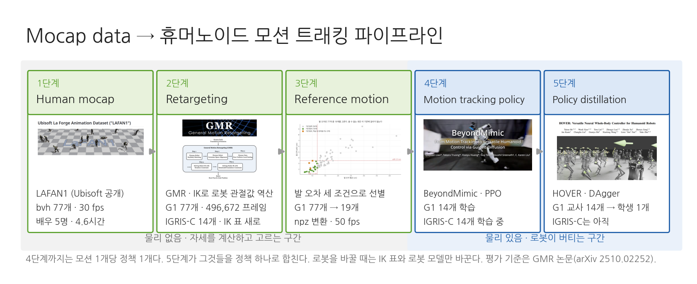

Stages 1 to 3 carry no physics: they compute poses and decide which ones are
worth keeping. Physics enters at stage 4, where the robot has to hold itself up.
Stage 5 merges the per-motion policies into one.

### 1. Human mocap

Motion capture records where every joint of a human body was at each instant,
as numbers rather than video.

Done: LAFAN1, 77 BVH sequences at 30 fps, five subjects, 4.6 hours.

### 2. Retargeting

Human joint data cannot be applied to the G1 directly: link lengths differ,
joint axes differ, and some human joints have no robot counterpart. Retargeting
solves for the robot joint angles that best reproduce the original motion while
respecting the robot's joint limits and keeping the feet on the ground.

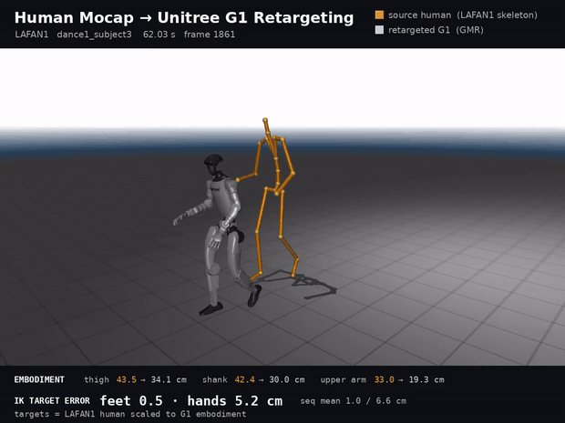

Orange is the source human skeleton straight out of the mocap file; grey is the
retargeted G1. The bands carry the segment lengths that make this hard and the
distance between each tracked body and the target the IK was solving for. The
robot is not walking here — each frame's joint angles are written straight into
the model and rendered. No simulation step runs.

Done: all 77 sequences retargeted with
[GMR](https://github.com/YanjieZe/GMR), 496,672 frames. Verified across every
frame: no NaNs or infinities, no joint-limit violations on any of the 29 joints,
frame counts matching the source BVH exactly.

### 3. Reference motion

The retargeted trajectory becomes the target the robot is asked to follow.
At this point nothing is physically simulated yet — only the goal exists.

Not every retargeted sequence is worth training on. The measure used here is how
far each tracked body ends up from the target GMR's IK was solving for. Only
pelvis, ankles and wrists are read: torso, shoulder and hip carry position
weights of 0 to 5, and their MuJoCo body origins do not coincide with the human
joint centres, so the constant offset there is not error.

Foot error by motion type, in cm:

```
walk         12 seqs  1.00      obstacles      17 seqs  1.65
dance         8 seqs  1.25      sprint          2 seqs  1.67
aiming        5 seqs  1.27      fallAndGetUp    6 seqs  2.11
run           4 seqs  1.33      ground          5 seqs  2.76
```

Walking is cleanest and floor work is worst, by a factor of three. Falling and
lying down put contact on parts other than the feet, which is not what an
ankle-weighted IK is set up for. Hand error stays at 5-9 cm regardless of motion
type — that is the arm-length gap, not a per-motion failure, so it is not used
to filter.

Done: 19 sequences clear all three foot thresholds — mean under 1.2 cm, p95
under 3.5 cm, max under 10 cm. The list is in
[`configs/selected_motions.txt`](configs/selected_motions.txt). Each was
converted to the 50 fps npz BeyondMimic reads, which adds the link velocities
the policy needs, and uploaded to a W&B registry.

The thresholds are not principled. They were picked because they leave 19
sequences, close to the 21 the GMR paper trained on. Once training shows which
sequences fail and where their error sits, the cut can be argued for.

### 4. Motion tracking policy

The robot is trained with reinforcement learning: it is rewarded for staying
close to the reference motion and penalised for drifting away or falling. The
control rule it converges on is the policy. Success is measured by tracking
accuracy, not by whether the walk merely looks plausible.

Training uses [BeyondMimic](https://github.com/HybridRobotics/whole_body_tracking),
the same framework the GMR paper used. It trains one policy per motion, so the
19 sequences mean 19 training runs. 4096 environments, 30000 iterations, PPO.

That repository targets IsaacSim 4.5 and IsaacLab 2.1.0. Running it against the
local IsaacSim 5.1 / IsaacLab 2.3.2 / rsl-rl 3.1.2 needed three interface
fixes, none of which touch the learning itself: `csv_to_npz.py` never leaves its
`while simulation_app.is_running()` loop after saving, which does not end under
`--headless`; `isaaclab.utils.io` no longer exports `dump_pickle`; and rsl-rl 3.x
moved the observation normalizer off the runner and into the policy.

Playing a trained policy back needs two more fixes in the same file,
`scripts/rsl_rl/play.py`. `--motion_file` is only read on the W&B branch, so a
local checkpoint starts with no reference motion, and `get_observations()` now
returns a TensorDict that the existing tuple unpacking splits along the batch
dimension, leaving a one-dimensional observation.

Done: the first policy, walk2_subject4, trained to 30000 iterations in 8 h 38 m
on an RTX 5080.

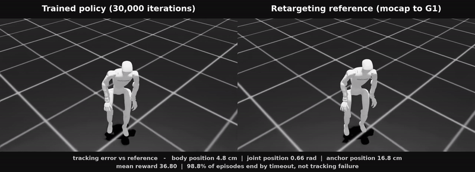

The gif above is six seconds of it. The whole sequence runs 3 minutes 58
seconds.

### 5. Policy distillation

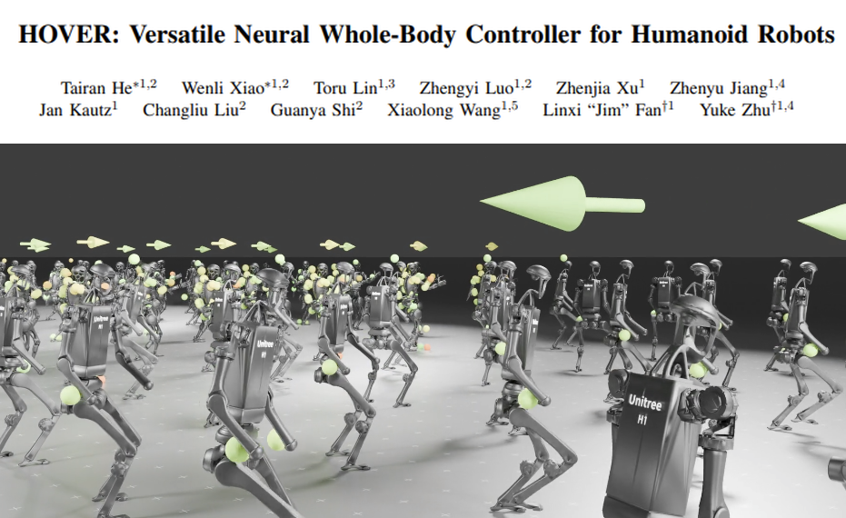

Stage 4 leaves one policy per motion. Driving 14 motions means holding 14
policies and picking one. Stage 5 merges them into a single policy.

The method is distillation. The 14 trained policies act as teachers while a
single student policy drives the simulator itself, asking the teachers at every
step what they would have done and copying the answer. Copying only the states
the teachers visited leaves the student unable to recover once it drifts, so the
student rolls out first and is labelled where it actually ends up. That is
DAgger ([Ross et al., 2011](https://arxiv.org/abs/1011.0686)).

The distillation code is [HOVER](https://github.com/NVlabs/HOVER)'s
`neural_wbc/student_policy`, used as is. The trainer, the student network, the
buffer and the loss are untouched; only the package-internal imports changed.
HOVER runs on IsaacLab and rsl-rl, the same stack as this repository.

HOVER assumes a single teacher, so one place had to change. The trainer hands
the teacher nothing but an observation tensor, which leaves the observation as
the only channel for saying which teacher to use. A motion index is appended to
the end of the teacher observation, and the teacher implementation strips it off
and routes each environment to its own teacher. Carrying the selector inside the
observation is what [parkour](https://github.com/ZiwenZhuang/parkour)'s
`ActorCriticFieldMutex` does.

The student is not given the motion index. With it, the student would memorise
the clip number and stop reading the reference. Tracking a motion it never
trained on requires judging from the reference alone.

The teacher observation is 161-dimensional (58 reference joint values, 9 anchor
error, 93 proprioception, 1 motion index); the student sees 260. The student
gets 100 terms the teacher does not — the reference-minus-current joint position
difference (29), the joint velocity difference (29), and the body position
difference in the anchor frame (42). This follows OpenTrack, whose student
receives the reference as a difference rather than raw: given only the raw
reference, the network has to learn the subtraction first.

Every teacher is [512, 256, 128]; the student is
[2048, 2048, 1024, 1024, 512]. **That capacity is what decided the result.**
It started at [1024, 512, 256] and one clip out of fourteen stayed stuck at 9%
completion. Sixteen hypotheses were falsified before the cause turned out to be
capacity: raising the training episode from 10 s to 40 s and widening the
network fourfold took the worst clip to 98.4%. This is the point the BumbleBee
paper makes when it reports that a three-layer MLP could not hold several
experts and was replaced with a transformer.

14 policies are used as teachers. Of the 17 that were trained, the three with a
0% completion rate have no finished rollout to imitate. kobe is held out as the
control for generalisation.

#### Multiple clips in one environment

The stage 4 environment takes a single npz. Distillation needs the student to
experience all 14 clips, so three places changed.

`MotionLoader` now accepts a list of npz files, concatenates them along time and
keeps the clip boundaries separately. Nothing is padded. The time index stays a
flat index into the concatenated array, so the existing indexing and anchor
transforms keep working. PHC, ProtoMotions and SONIC all use the same layout.

The clip a given environment is following is not stored: it is a binary search
of the time index against the clip boundaries. Anything stored separately can
drift out of sync.

Per-clip sampling probability is capped. With failure-driven adaptive sampling
alone, one hard clip takes over the distribution and the easy ones are
forgotten. SONIC caps it for the same reason with `max_prob_per_motion`, and
notes that roughly twice the fair share is the conservative choice when
diversity matters. The same factor of two is the default here.

There is a second reason for the cap. Walking accounts for 67% of the frames
across the 14 clips (107,777 of 162,049). Sampling uniformly without a cap tilts
the merged policy toward walking.

#### Result — fourteen into one, with no loss of accuracy

64 rollouts, domain randomization off, full clip length.

| | Completion | E_g-mpbpe | E_mpbpe | E_mpjpe |
|---|---|---|---|---|
| 14 experts, each on its own clip | 99.0% | 102mm | 42mm | 0.084 |
| **one unified policy** | **99.7%** | **90mm** | **41mm** | **0.082** |

Both sides: 100 rollouts, the same condition, identical evaluation code. **The
unified policy matches or beats the experts on all six metrics.** Eleven of the
fourteen complete at 100% and the other three (walk1_subject1 and walk2_subject3
at 99%, jumps1_subject1 at 98%) stay above 98%, and global position error is lower on all fourteen, by 12 mm on
average.

Three things come with it.

- **sim-to-sim** — the same onnx file, with no retraining and no gain retuning,
  completes 12 of 14 in MuJoCo. Global error grows 5-20% but the anchor-aligned
  error is actually lower in MuJoCo, meaning the posture tracks and what
  accumulates is global drift.
- **domain randomization** — 76.1% mean with a random push every 1-3 s and
  randomized friction, torso CoM, joint offsets and reset pose. The more
  dynamic the motion, the more it costs (running 43.8%, walk4 98.4%).
- **motion transition** — switching the reference to the next clip without
  resetting the robot holds for 6 of 13 boundaries. Fourteen separate experts
  structurally cannot do this: the instant you swap networks, the robot is in a
  state the incoming policy has never seen.

#### What it cannot do was measured too

Every remaining LAFAN1 sequence — 63 clips — was retargeted and run through the
same policy. Nothing was retrained. The split follows SONIC. This table is over
**64 rollouts**; the teacher comparison above is over 100. Completion turns out
to be insensitive to both - the same clip measured at 32, 64, 128 and 256
environments stays within 2 points.

| | Clips | Completion | Survived |
|---|---|---|---|
| the 14 training clips | 14 | 99.89% | 100% |
| test-repetition — a motion type **in** training, a take that is not | 35 | 0.0% | 13.4% |
| test-content — a motion type **not** in training | 28 | 0.0% | 8.6% |

**Not one of the 63 runs to the end.** The ordering tracks distance from the
training distribution: walk 48.9% > aiming 22.1% > dance 15.7% > run 13.8% >
obstacles 5.1% > jumps 1.4%, and fight, ground and fallAndGetUp — lying down and
heavy contact — bottom out at 3-5%.

Fourteen clips is three orders of magnitude below what general trackers train on
(GMT 8,925, SONIC 317,189). Generalization was never on the table at this scale.
Being conditioned on the reference rather than a clip index is a **necessary
condition for generalization, not a sufficient one.**

#### Under perturbation the experts win

The "no loss" above is measured in clean conditions. Putting teachers and
student under identical pushes reverses it.

| Push magnitude | 14 experts | unified policy |
|---|---|---|
| same as training | 91.0% | 84.3% |
| twice that | 31.7% | 23.3% |

E_g-mpbpe is still lower for the unified policy on 11 of 14 clips. Tracking accuracy
holds; what degrades is **recovery after being pushed**. Distillation learning
the teachers' mean behaviour, with recovery from perturbed states rare in the
data, is a plausible explanation but was not verified. Adding perturbation to
the DAgger rollouts may change it.

### ▶ Full clip (YouTube)

[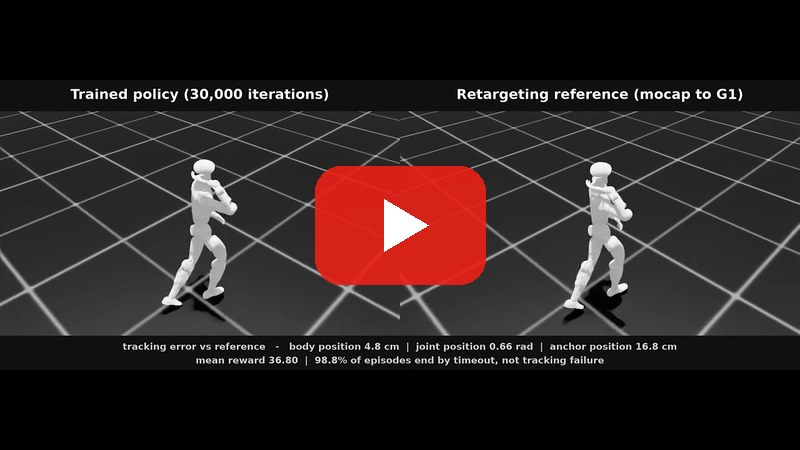](https://youtu.be/l1M4y_Nl7oc)

Click the image above to play it on YouTube — https://youtu.be/l1M4y_Nl7oc

Left is the trained policy stepping through physics, right is the reference it
was asked to follow. Both panels are Isaac Sim under the same lighting and
camera, start from the same motion frame, and run the full 11,909 frame
sequence. They never match pixel for pixel: the initial pose is randomised at
every reset, and the left robot has to hold itself up while the right one is
posed frame by frame.

### ▶ Training progression (YouTube)

[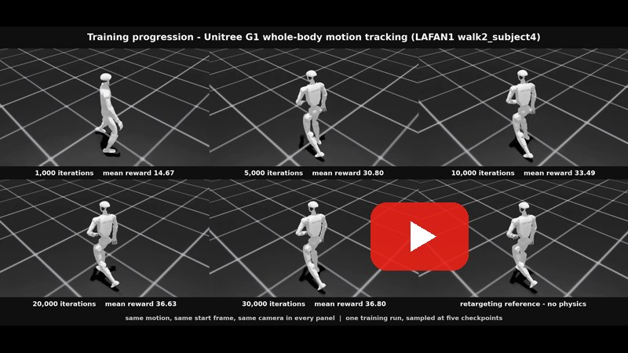](https://youtu.be/qQw8PtmXV9s)

Click the image above to play it on YouTube — https://youtu.be/qQw8PtmXV9s

Five checkpoints of the same run and the reference, played at once on the same
motion, the same start frame and the same camera. Mean reward runs 14.67 at
1,000 iterations, 30.80 at 5,000, 33.49 at 10,000, 36.63 at 20,000 and 36.80 at
30,000, so most of the gain lands early and the later checkpoints separate on
how long they hold rather than on the number.

### ▶ Domain randomization (YouTube)

[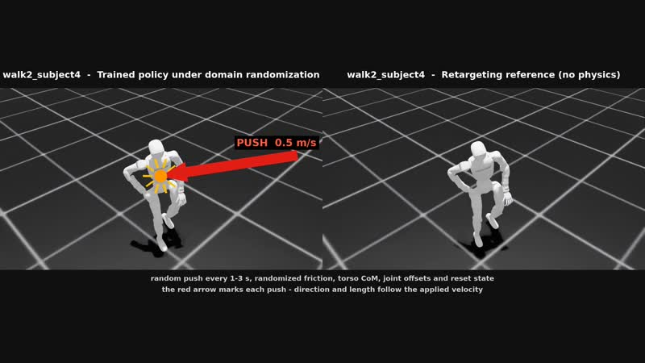](https://youtu.be/d61rKk675qY)

Click the image above to play it on YouTube — https://youtu.be/d61rKk675qY

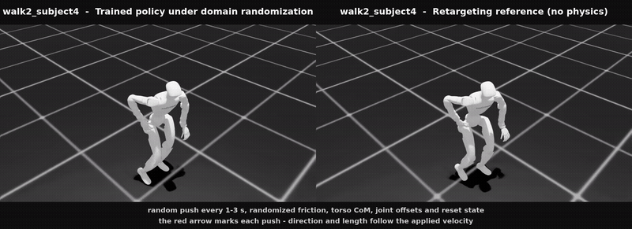

Six seconds out of it. On the left is the policy running with domain
randomization on, on the right is the reference. A random push lands every 1-3
seconds, and friction, torso centre of mass, joint offsets and the reset pose
are randomized as well.

A push only adds to the torso velocity, so nothing about it is visible on
screen. The moment the value goes in, the contact point is marked, an arrow is
drawn along the push direction, and the added speed is written next to it. The
arrow stays for one second.

With randomization on, the policy can drift off the reference or the episode can
end early. It then restarts from frame 0, so the two sides fall out of phase.
That is part of the result too.

### Evaluation criteria

Policies are measured the way the GMR paper
([arXiv:2510.02252](https://arxiv.org/abs/2510.02252)) measures them. It uses
the same dataset and the same training framework, so the numbers can be placed
side by side.

| metric | meaning |
| --- | --- |
| completion rate | fraction of rollouts that reach the end of the clip without the anchor body's height or orientation passing its threshold |
| E_g-mpbpe | mean body position error in global coordinates (mm) |
| E_mpbpe | mean body position error after aligning on the anchor (mm) |
| E_mpjpe | mean joint angle error (rad) |
| E_mpbve | mean body velocity error (mm/frame) |
| E_mpbae | mean body acceleration error (mm/frame²) |

`scripts/eval_all.sh` measures, `src/eval_table.py` builds the table. Domain
randomization is off by default and `--randomize` turns it on, matching the way
the paper separates its sim and sim-dr conditions.

17 of the 19 selected sequences were trained to 30,000 iterations and
evaluated over 100 rollouts. Completion rate sits next to foot error, to see
whether retargeting quality predicts whether the policy holds.

| sequence | foot error (cm) | completion | E_g-mpbpe (mm) | E_mpbpe (mm) | E_mpjpe (rad) |
| --- | --- | --- | --- | --- | --- |
| walk4_subject1 | 0.88 | 100% | 60 | 37 | 0.062 |
| walk3_subject2 | 0.99 | 100% | 79 | 34 | 0.071 |
| walk1_subject2 | 1.05 | 100% | 79 | 34 | 0.066 |
| walk3_subject5 | 1.11 | 100% | 85 | 36 | 0.082 |
| aiming1_subject1 | 0.74 | 100% | 89 | 35 | 0.080 |
| walk1_subject5 | 1.12 | 100% | 90 | 34 | 0.069 |
| dance2_subject3 | 0.94 | 100% | 103 | 45 | 0.104 |
| walk2_subject1 | 0.91 | 100% | 114 | 43 | 0.101 |
| walk1_subject1 | 0.80 | 99% | 80 | 34 | 0.066 |
| walk2_subject4 | 0.70 | 99% | 90 | 40 | 0.085 |
| run2_subject4 | 1.12 | 99% | 178 | 47 | 0.111 |
| jumps1_subject1 | 1.10 | 98% | 151 | 42 | 0.104 |
| obstacles3_subject3 | 1.19 | 98% | 162 | 54 | 0.101 |
| walk2_subject3 | 1.15 | 96% | 129 | 50 | 0.104 |
| walk3_subject4 | 0.88 | 0% | - | - | - |
| obstacles2_subject1 | 0.93 | 0% | - | - | - |
| walk3_subject1 | 1.01 | 0% | - | - | - |
| obstacles1_subject1 | 1.07 | not trained |  |  |  |
| obstacles4_subject2 | 1.19 | not trained |  |  |  |

The three sequences at 0% have no completed rollout, so the three metrics are
undefined. Mean tracked length and E_g-mpbpe over all rollouts instead:

| sequence | mean tracked length | E_g-mpbpe over all rollouts (mm) |
| --- | --- | --- |
| walk3_subject4 | 88% (10,862 / 12,330 frames) | 116 |
| walk3_subject1 | 78% (9,606 / 12,330 frames) | 112 |
| obstacles2_subject1 | 18% (2,144 / 12,204 frames) | 368 |

Foot error ranking did not predict policy performance. The three sequences at
0% sit mid-range at 0.88, 0.93 and 1.01 cm, while obstacles3_subject3 at the
high end (1.19 cm) completes 98% of rollouts. walk4_subject1, which has the
lowest E_g-mpbpe at 60 mm, is at 0.88 cm rather than the top of the list.

It is clearer on video. Once a termination condition fires the episode ends and
restarts from frame 0, so on screen the robot snaps back to its initial pose.

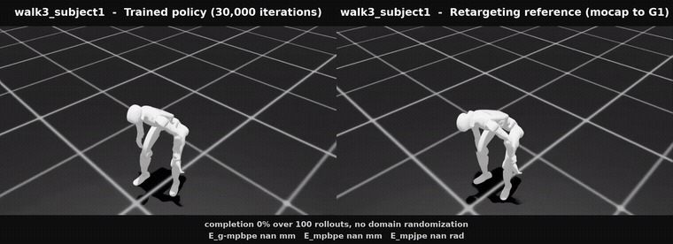

walk3_subject1 at 195 s, where the anchor height crosses its threshold.

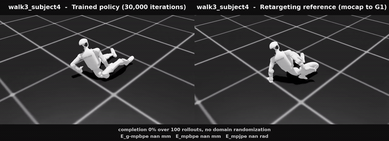

walk3_subject4 at 218 s, where an ankle or wrist height crosses its threshold.

A 0% completion rate does not mean the policy never follows the reference. It
follows for over three minutes and then catches on one moment. That is what the
78% and 88% mean tracked lengths are describing.

### The three that never finish are a reference problem, not a training one

Re-measuring the references with `src/motion_defect_census.py` separates them
at a glance.

| sequence | ground penetration | max penetration | peak foot slip | airborne |
| --- | --- | --- | --- | --- |
| obstacles2_subject1 | 0.9% | 4.2 cm | 0.35 m/s | 26.8% |
| walk3_subject1 | 6.0% | 7.6 cm | 1.59 m/s | 0.2% |
| walk3_subject4 | 4.3% | 4.8 cm | 1.08 m/s | 0.2% |
| walk1_subject1 (completes) | 0.0% | 0.4 cm | 0.90 m/s | 0.0% |

`obstacles2_subject1` spends 26.8% of its frames airborne: the actor is
climbing stairs and the training ground is flat, so there is nothing for the
feet to land on. The other two push their feet into the floor, up to 7.6 cm.
The sequence that completes penetrates 0% of the time.

The policy is not failing to follow the reference. The reference is not
reachable. Selection looked at foot error alone, and on that ranking these
three sit mid-range, so they passed. Ground penetration and airborne fraction
were never checked.

### The work that reports 96-100% on the same material does two more things

Retargeting Matters([arXiv:2510.02252](https://arxiv.org/abs/2510.02252))
reports 96-100% over 100 sim rollouts on the same LAFAN1, the same G1 and the
same BeyondMimic. The paper states both differences directly.

It leaves the problem motions out to begin with:

> We do not include motions with complex interaction with the environment,
> such as crawling or getting up from the floor

The three sequences that never finish here are exactly that category.

And it measures penetration and corrects for it:

> We fix this by running forward kinematics on the retargeted sequences,
> storing the minimum body height at each frame, and then offsetting the
> entire motion by the mean minimum body height

Neither was done here. The gap sits in stage 3, not in the policy.

---

## sim-to-sim — does it survive a second simulator

A policy that only works in the simulator it was trained in is not evidence of
anything. The same onnx actor was loaded into MuJoCo with no retraining and no
fine-tuning, and all seventeen sequences were replayed for the full clip length.

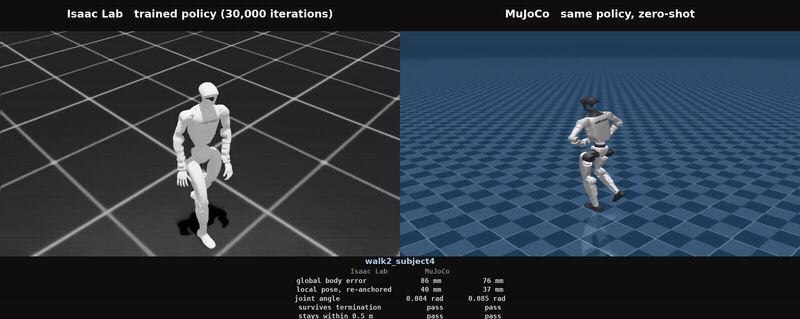

Six seconds of walk2_subject4. Isaac Lab on the left, the same policy in MuJoCo
on the right. Both panels start and end on the same instant.

### There is no single pass criterion

Criteria differ by lineage and they measure different things, so the same
rollouts were scored under both. `src/score_standard.py` does this.

BeyondMimic scores by termination (`tracking_env_cfg.py` 255-275). The episode
ends the moment any of the three fires.

| condition | quantity | threshold |
| --- | --- | --- |
| anchor_pos | \|ref_anchor_z − rob_anchor_z\| | 0.25 |
| anchor_ori | \|ref_gravity_z − rob_gravity_z\| | 0.8 |
| ee_body_pos | ankles and wrists, \|ref_rel_z − rob_z\| | 0.25 |

PolySim([arXiv:2510.01708](https://arxiv.org/abs/2510.01708)) counts a rollout
as failed once the mean global body position error crosses 0.5 m.

All three termination conditions look at z alone. None of them sees horizontal
drift, and PolySim's threshold is built to catch exactly that. The two criteria
are not measuring the same thing.

One caveat. PolySim's text says mean body position error over 0.5 m, but the
released code tests whether any single body exceeds a curriculum threshold
(1.5 m by default) and has that check disabled in the default configuration.
The numbers below implement the text.

### Is anything lost in transfer

The same policy was run in Isaac, where it was trained, and in MuJoCo, which it
had never seen. The numbers do not drop.

| metric | Isaac | MuJoCo | over |
| --- | --- | --- | --- |
| Success rate | 0.765 | 0.775 | 17 sequences |
| Success rate (excluding the three at zero) | 0.929 | 0.941 | 14 sequences |
| E_g-mpbpe | 108.3 mm | 101.3 mm | 14 sequences |
| E_mpjpe | 0.594 rad | 0.593 rad | 14 sequences |

100 runs each. Error is averaged over completing runs only, so the three that
complete none (`obstacles2_subject1`, `walk3_subject1`, `walk3_subject4`) drop
out of the last three rows.

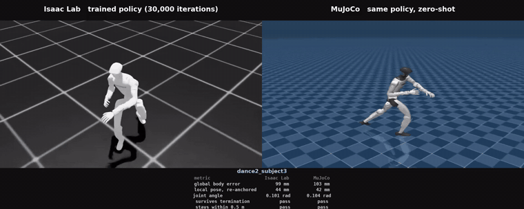

The most dynamic five seconds of `dance2_subject3`. Isaac Lab on the left, the
same policy dropped into MuJoCo on the right. This sequence is where the two
simulators agree most closely — 0.99 against 1.00 completion, 104.4 against
104.3 mm global error.

The rest of this section is how those numbers were produced.

Putting two simulators side by side requires the two columns to be the same
quantity. Four things were matched.

| item | what was matched |
| --- | --- |
| scorer | `src/score_standard.py` alone; `scripts/beyondmimic/eval_sym.py` uses the same expressions on the Isaac side |
| perturbation | the `MotionCommandCfg` values from `tracking_env_cfg.py` on both sides: root position, orientation, velocity and joints, uniform |
| alignment | reference and robot are read at the same instant |
| termination | both sides roll to the end without early termination; the two criteria are computed afterwards |

The last row is the one that matters. With Isaac's termination enabled, an
episode ends the moment the robot falls, so global error after the fall is never
recorded and a failed rollout scores as a PolySim success. MuJoCo has no
termination, rolls to the end, and a fallen robot always crosses 0.5 m. The two
numbers would carry the same name while measuring different things.

Three conditions: sim is Isaac without perturbation, sim-dr is Isaac with it over
100 environments, sim2sim is MuJoCo with the same perturbation over 100 trials.
The window is full clip length.

| | sim | sim-dr | sim2sim | retention |
| --- | --- | --- | --- | --- |
| BeyondMimic success | 0.779 | 0.765 | 0.775 | 101.4 % |
| PolySim success | 0.668 | 0.633 | 0.609 | 96.3 % |
| global body error | 105.6 mm | 108.3 mm | 101.3 mm | 106.9 % |
| local pose, re-anchored | 40.5 mm | 40.6 mm | 38.0 mm | 106.7 % |
| joint angle | 0.594 rad | 0.594 rad | 0.593 rad | 100.2 % |

Retention is MuJoCo/Isaac for success rates and Isaac/MuJoCo for errors, so 100 %
means nothing was lost either way. Nothing is lost.

Above 100 % does not mean MuJoCo is the better engine. Contact handling and the
solver differ. The sentence this supports is that there is no transfer loss, and
no more than that. The comparable published figure is PHUMA appendix D.3, which
reports 90.5 % and 93.2 % retention going from Isaac Gym to MuJoCo.

Per sequence, ordered by completion rate to match the training results table
above.

| column | meaning |
| --- | --- |
| S_bm | share of rollouts that never trip any of the three BeyondMimic termination conditions, at the thresholds in the table above |
| S_poly | share of rollouts whose mean global body error never crosses 0.5 m, judged independently of S_bm |
| global | mean body position error in world coordinates (mm); grows with root drift |
| local | the same error after re-anchoring the reference to the robot anchor (mm), which removes root drift and leaves posture |

Isaac columns are sim-dr (100 environments), MuJoCo columns are sim2sim (100
trials). Errors are averaged over completing trials only, so the three with none
are undefined.

| sequence | S_bm Isaac | S_bm MuJoCo | S_poly Isaac | S_poly MuJoCo | global Isaac | global MuJoCo | local Isaac | local MuJoCo |
| --- | --- | --- | --- | --- | --- | --- | --- | --- |
| `walk4_subject1` | 1.00 | 1.00 | 0.99 | 0.96 | 61.1 | 55.0 | 36.8 | 33.9 |
| `walk3_subject2` | 1.00 | 1.00 | 1.00 | 0.99 | 83.2 | 70.3 | 34.5 | 31.1 |
| `walk1_subject2` | 1.00 | 1.00 | 0.99 | 1.00 | 79.8 | 73.7 | 34.6 | 31.1 |
| `walk3_subject5` | 1.00 | 0.99 | 0.88 | 0.88 | 86.5 | 88.8 | 35.7 | 37.0 |
| `aiming1_subject1` | 0.99 | 1.00 | 0.93 | 0.86 | 89.7 | 74.2 | 35.6 | 32.4 |
| `walk1_subject5` | 1.00 | 0.94 | 0.99 | 0.86 | 91.2 | 86.2 | 33.9 | 31.5 |
| `dance2_subject3` | 0.99 | 1.00 | 0.99 | 1.00 | 104.4 | 104.3 | 45.4 | 42.3 |
| `walk2_subject1` | 1.00 | 1.00 | 0.91 | 0.95 | 115.2 | 101.7 | 43.2 | 41.0 |
| `walk1_subject1` | 1.00 | 1.00 | 0.96 | 0.99 | 77.7 | 69.3 | 33.9 | 30.6 |
| `walk2_subject4` | 0.99 | 0.99 | 1.00 | 0.98 | 91.7 | 77.6 | 40.3 | 36.7 |
| `run2_subject4` | 0.83 | 0.73 | 0.00 | 0.00 | 181.1 | 174.9 | 47.0 | 44.5 |
| `jumps1_subject1` | 0.98 | 0.97 | 0.05 | 0.14 | 155.3 | 143.3 | 42.6 | 40.6 |
| `obstacles3_subject3` | 0.58 | 0.80 | 0.62 | 0.75 | 165.6 | 160.1 | 54.7 | 51.1 |
| `walk2_subject3` | 0.64 | 0.76 | 0.45 | 0.00 | 134.0 | 138.8 | 50.2 | 48.8 |
| `walk3_subject4` | 0.00 | 0.00 | 0.00 | 0.00 | — | — | — | — |
| `obstacles2_subject1` | 0.00 | 0.00 | 0.00 | 0.00 | — | — | — | — |
| `walk3_subject1` | 0.00 | 0.00 | 0.00 | 0.00 | — | — | — | — |

The seventeen fall into four groups by motion type.

The ten walking, aiming and dance clips (`walk4_subject1` through
`walk2_subject4`) hold S_bm at 0.94 or better on both sides and S_poly at 0.86 or
better, with 61-115 mm global and 31-45 mm local error. All four metrics sit
close together across the two simulators.

Running and jumping (`run2_subject4`, `jumps1_subject1`) hold S_bm at 0.73-0.98
while S_poly drops to 0.00-0.14. They do not fail by falling, they fail by
drifting. Their global error of 155-181 mm is also the largest of the seventeen.
The faster the motion, the more heading error accumulates over a long clip. One
criterion alone hides this entirely.

`obstacles3_subject3` and `walk2_subject3` go the other way on S_bm: 0.58 and
0.64 in Isaac against 0.80 and 0.76 in MuJoCo. Something in the Isaac run is
harsher, and it is not transfer getting worse. `walk2_subject3` is the exception
worth naming — its S_poly falls from 0.45 to 0.00, the one cell where MuJoCo is
clearly worse.

The three with no completed rollout have no error to report.
`obstacles2_subject1` survives 8.6 % of its clip and is unconverged;
`walk3_subject1` and `walk3_subject4` reach 77-87 % and fail near the end, where
the LAFAN1 actor sits or lies down and the selection criterion never looked.
Retargeting Matters reports 96-100 % on the same LAFAN1, G1 and BeyondMimic, so
these three are a training and motion-selection problem, not a transfer problem.

Three things run through all of it. MuJoCo is worse than Isaac in only three
cells out of the fourteen that report error — global on `walk3_subject5` and
`walk2_subject3`, local on `walk3_subject5` — and equal or better everywhere
else. Error magnitude is set by motion difficulty rather than by simulator:
61-115 mm for walking, 104-166 mm for obstacles and dance, 155-181 mm for
jumping and running. And failure splits in two: a low S_bm means the robot fell,
which is a training and selection problem, while a low S_poly alone means
heading error accumulated over a long clip.

The two scorers were checked against each other first. Isaac's env 0 rollout was
dumped in full, rescored with the MuJoCo scorer, and compared against the online
values: all five metrics agree to four decimal places, the residual coming from
the dump being float16. No column was placed in a shared table before that check
passed.

### Posture crosses over, position does not

Joint angle error is 0.594 rad in Isaac and 0.593 rad in MuJoCo. Posture crosses
over with essentially no loss.

What does not cross over is position. Re-anchoring MuJoCo's 101.3 mm global body
error to the robot anchor drops it to 38.0 mm, so 62 % of the error is root
position and heading drift rather than posture. The same drift appears in Isaac
(108.3 → 40.6 mm), so it is not a MuJoCo artefact.

### The three that do not complete

Fourteen of seventeen complete the full clip. The remaining three are the zeros
in table B: `obstacles2_subject1`, `walk3_subject1` and `walk3_subject4`. They
differ in kind. The first survives 8.6 % of its clip and is unconverged; the
other two reach 77-87 % and fail near the end, where the LAFAN1 actor sits or
lies down and the selection criterion never looked for that.

### Code

| file | what it does |
| --- | --- |
| `src/sim2sim.py` | runs the onnx actor in MuJoCo |
| `src/sim2sim_polysim.py` | the five PolySim metrics |
| `src/score_standard.py` | scores one rollout set under both criteria |
| `src/sim2sim_trials.py` | N trials per sequence under Isaac's perturbation spec |
| `src/sym_table.py` | collects the three conditions into tables A, B and C |
| `src/sym_table_png.py` | renders the same tables as an image |
| `scripts/sym_all.sh` | re-measures all 17 under the three conditions |
| `scripts/make_video_pair.sh` | renders both panels on the same instant |

---

## Model mismatch — which discrepancy breaks it

There is no hardware, so sim-to-real cannot be measured. Instead, each axis on which a
simulator can disagree with a real robot was perturbed **on its own**, to see where the
consolidated policy fails. 14 clips, 64 rollouts per clip, domain randomization off,
full clip length.

| Axis | Completion |
|---|---|
| Baseline | 99.9% |
| **Latency** 1 step (20 ms) / 2 steps | **29.6% / 0%** |
| Torque limit ×0.85 / ×0.7 / ×0.5 | 92.6% / 56.4% / 0% |
| Mass ×0.9 / ×1.1 / ×1.2 | 99.8% / 91.7% / 25.0% |
| Observation noise ×1 / ×2 / ×3 | 98.4% / 78.1% / 32.5% |
| Friction ×0.5 / ×0.7 / ×1.5 | 70.3% / 99.9% / 99.2% |
| PD gain ×0.9 / ×1.1 | 97.8% / 100% |

**Latency is the only cliff.** Every other axis degrades gradually; one step of latency
removes 70 points. Latency was never in the domain randomization. Torque, gain, mass
and friction were varied during training, but the policy never saw a delayed command.
Fixing it means mixing latency into training or putting recent command history into
the observation.

The rest are one-sided. Only heavier, more slippery or weaker hurts. Higher gains are,
if anything, safer (100% at ×1.05 and ×1.1).

Errors are averaged over completed rollouts only, so **read them together with
completion**. At torque ×0.7 the E_g-mpbpe is lower than baseline because half the
rollouts dropped out and only the easy stretches remain.

## Real-time inference loop — does it fit the 20 ms budget

Since one step of latency is fatal, whether inference fits in the control period (50 Hz,
20 ms) is a deployment condition. The MuJoCo control loop was ported to C++ (`cpp/`).
A Python loop fed the same inputs is the control; after 1000 control steps both give
identical root position, orientation and joint angles.

| (ms, 8195 steps) | p50 | p99 | p99.9 | max |
|---|---|---|---|---|
| C++ inference | 0.42 | 0.99 | 1.15 | 1.51 |
| C++ full control cycle | 0.92 | 1.52 | 1.72 | 2.29 |
| Python full control cycle | 1.10 | 1.74 | 1.95 | 2.42 |

There is close to a tenfold margin. Before starting I expected Python's tail to be
heavier because of garbage collection. That was wrong. Python's cost is **a constant
0.2 ms per cycle**, not a heavier tail; the network is small and the GC has nothing to do.

The worst case came from the OS. In one run **both** implementations went over 20 ms,
with the spikes clustered in one stretch. So this measurement supports "inference costs
far less than the budget" and nothing more. It does not show that C++ guarantees real
time; that would take real-time scheduling and CPU isolation, which were not done.

## A second robot — IGRIS-C

To check that the pipeline is not tied to the G1, a second humanoid is being added:
[IGRIS-C](https://github.com/robrosinc/igris_c_description_public) (1.5 m, 58 kg,
31 DoF). Retargeting is done so far.

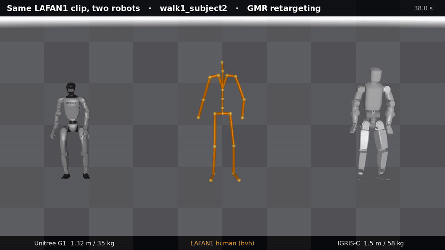

The same LAFAN1 clip retargeted onto the G1 (left) and IGRIS-C (right), in one scene with
the human skeleton in the middle. GMR also scales the root trajectory, so the G1 walks
0.88 times the human's path. To keep them side by side, each robot's hip is moved onto
the human's horizontal hip position every frame; poses are untouched.

Adding a robot to GMR takes four things: the robot model, which human bone drives which
link, a length ratio per body part, and a rotation offset per link. The IGRIS-C table was
derived from the G1 one, and two things were wrong.

- **Forearms.** At zero pose the G1 forearm points forward and the IGRIS-C forearm points
  down. With the G1 offsets the elbows sat on their joint limit in 80-88% of frames.
  Turning the elbow and wrist offsets by 90° fixed it.
- **Leg ratio.** The IGRIS-C sole is 7.1 cm below the ankle joint, twice the G1's
  3.5 cm. Scaling the legs by ankle height sank the feet into the floor in all 14 clips.
  Scaling by sole height cut the clips with more than 3 cm of penetration from 14 to 4.
  The remaining four have crouching or crawling.

The model has no license file, so no IGRIS-C mesh or XML is in this repository. The
scripts in `scripts/igris/` read a local clone and write locally.

| File | What it does |
| --- | --- |
| `scripts/igris/prepare_mjcf.py` | MJCF for retargeting; drops 29 backlash joints and 22 finger joints |
| `scripts/igris/prepare_urdf.py` | URDF for training; fills the placeholder torque limits from the MJCF actuators |
| `scripts/igris/make_ik_config.py` | derives the IGRIS-C IK table from the G1 one |
| `scripts/igris/compare_retarget.py` | compares both robots' retargets on foot penetration, joint limits and velocity spikes |
| `scripts/igris/fit_slot_map.py` | maps IGRIS-C joints onto the G1 policy's 29 slots (below) |
| `src/render_retarget_two.py` | renders the clip above |

**The G1 policy does not run on IGRIS-C as is.** Its inputs and outputs are laid out
for the G1's 29 joints and it learned the G1's mass and motors. Prior work,
[Any2Any](https://arxiv.org/abs/2605.23733), maps the joints onto the original
policy's slots and fine-tunes part of it on the new robot, beating training from
scratch at a fraction of the compute. The same comparison is set up here. Mapping by
joint name is wrong: the waist axes have opposite signs, the elbows zero 90° apart, and
because the forearms point along different axes the wrist roll and yaw swap. Signs and
offsets were fitted on the same 14 clips retargeted onto both robots; every one of the
29 pairs correlates at |r| ≥ 0.72.

---

## Layout

```
src/       retargeting, metrics, rendering, table building
scripts/   batch drivers (scripts/igris/ for the second robot)
configs/   selection and training order
docs/      figures used in this README
cpp/       real-time inference loop (C++) and its Python control
outputs/   motions, metrics, logs, videos (gitignored)
data ->    symlink to local dataset root (gitignored)
```

| script | what it does |
| --- | --- |
| `scripts/retarget_all.sh` | retarget all 77 LAFAN1 sequences to the G1 |
| `scripts/quality_all.sh` | measure IK target tracking error per sequence |
| `scripts/render_compare.sh` | render the human skeleton and the robot into one video |
| `scripts/npz_all.sh` | convert selected sequences to npz and upload to the registry |
| `scripts/train_chain.sh` | train the sequences one after another |
| `scripts/eval_all.sh` | measure completion rate and tracking error of trained policies |
| `scripts/render_tracking.sh` | render policy and reference side by side |
| `scripts/make_pipeline_figure.py` | generate the pipeline figure in this README |
| `src/eval_table.py` | put evaluation results next to the foot error as a table |

## Data

Motion datasets run to tens of gigabytes and are not tracked in this repo.
They live under `/home/sehoon/data`, reached through the `data` symlink.

### Primary source — LAFAN1

[LAFAN1](https://github.com/ubisoft/ubisoft-laforge-animation-dataset) is used
as the input to retargeting. 4.6 hours, 77 sequences, 5 subjects, BVH at 30 fps.
It was picked over the larger alternatives for three reasons:

1. Format. BVH is consumed directly by the retargeting tools in use; no
   intermediate body-model fitting step is required.
2. Comparability. Prior work has published per-sequence tracking success rates
   for four retargeting methods on a 21-sequence subset of LAFAN1, so results
   here can be placed against known numbers rather than argued for.
3. Motion range. Sequences run 5 s to 2 min and span walking and turning through
   martial arts and dance, which separates the cases retargeting handles from
   the ones it breaks on.

Download `lafan1.zip` from the [official repo](https://github.com/ubisoft/ubisoft-laforge-animation-dataset/blob/master/lafan1/lafan1.zip)
and unzip it into `data/lafan1`. All 77 `.bvh` files sit flat in that directory.

### Reference — already-retargeted G1 motions

These ship motions that have already been retargeted to the G1. They are not
inputs, and they are not ground truth either — they are another method's output.
Comparing joint angles against them measures how far two methods diverge, not
how much error either one carries. They are kept for qualitative reference only.

| dataset | contents | local path |
| --- | --- | --- |
| lvhaidong/LAFAN1_Retargeting_Dataset | LAFAN1 retargeted to G1 | `data/lafan1_g1_ref` |
| bones-studio/seed | 142,220 Vicon motions, human and G1 side | `data/bones_seed` |

SEED is held for later. It is larger than LAFAN1 and pairs each motion with the
capture subject's measured body dimensions, but its human-side data is in a
custom format whose compatibility with the retargeting tools is unverified, and
no published baseline exists for it. It becomes useful once the pipeline runs.

AMASS is deferred to the training stage, where scale matters more than
comparability.

## Tools

| tool | role |
| --- | --- |
| [GMR](https://github.com/YanjieZe/GMR) | retargeting tool in use; MIT, takes LAFAN1 BVH and outputs G1 joint angles |
| Isaac Sim 5.1 / Isaac Lab 2.3.2 | reference motion playback, and RL training in stage 4 |
| [IGRIS-C model](https://github.com/robrosinc/igris_c_description_public) | the second robot; it has no license file, so it is linked, not copied |

Retargeting itself needs no physics simulation — it is a kinematics problem.
The simulator enters at playback and at policy training.

## Background

The premise that retargeting quality is worth treating as its own problem comes
from *Retargeting Matters: General Motion Retargeting for Humanoid Motion
Tracking* ([arXiv:2510.02252](https://arxiv.org/abs/2510.02252)), which showed
that artifacts left in retargeted trajectories — foot sliding, self-penetration,
physically infeasible poses — measurably reduce the robustness of the tracking
policy trained on them.

### kobe — does it hold outside LAFAN1

All 17 above are LAFAN1 walking and dance. There is no high-difficulty one-shot
motion among them, so one motion from the ASAP dataset, kobe, was converted with
`src/asap_to_csv.py` and run through the same pipeline: 206 frames, 4.1 s.

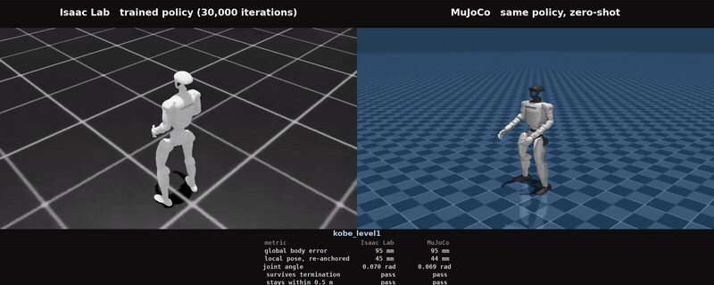

The full 4.1 s. Isaac Lab on the left, MuJoCo on the right. Over 100 MuJoCo
trials: BeyondMimic success 1.000, PolySim success 0.990, global body error
128.0 mm. No transfer loss here either.

Stated plainly to avoid a misreading: this clip runs on a policy trained for
kobe alone. The policies trained on the seventeen did not track it. This
pipeline is one policy per motion, so kobe got its own 30,000 iterations. What
this shows is transfer, not generalisation.

So the clip supports exactly one claim: that transfer working is not a property
of LAFAN1. A four-second, fast motion from a different dataset behaves the same
way. One clip is not a sample, and nothing beyond that is claimed.

Where this clip becomes worth more is later. Once several motions are merged
into a single policy, kobe can be held out of training and used to measure
generalisation — a different dataset, a motion type absent from training, and a
short fast segment all put it clearly outside the training distribution.

It took three training runs. The first two never converged: the csv was
written in Isaac joint order rather than URDF order, which put
`error_joint_pos` at 2.44 rad, and the reference floated above the ground.

This clip is not placed against PolySim's table, for three reasons. First, the
0.100 in their Table III for `IsaacSimDR → MuJoCo` is not PolySim's own result;
it is the single-simulator DR baseline the table exists to argue against.
PolySim's own row is the last one, `IsaacSim+IsaacGym+Genesis`, at 1.000.
Second, the paper names neither the 14 motions nor the 5 motions it evaluates on
— Kobe is the only motion named anywhere in the text — so the same set cannot be
assembled. Third, the trainer differs: PolySim uses HumanoidVerse with ASAP
rewards and teacher-student, this uses BeyondMimic. Retargeting Matters reports
sim2sim success mostly at 100 % on the same LAFAN1, G1 and BeyondMimic, so the
1.000 here is the ordinary value for this lineage, not a win over PolySim.

## Summary — what works and what does not

**What works**

| | Completion | E_g-mpbpe | E_mpbpe | E_mpjpe |
|---|---|---|---|---|
| 14 experts, each on its own clip | 99.0% | 102mm | 42mm | 0.084 |
| **one unified policy** | **99.7%** | **90mm** | **41mm** | **0.082** |

Fourteen single-motion experts consolidate into one policy with no loss of
tracking accuracy - joint angle error matches to three decimals. With it
come MuJoCo transfer at 12/14, 76.1% under domain randomization, and 6 of 13
motion transitions without resetting the robot.

One clip blocked this for a long time and the cause was **capacity**. `aiming1`
stayed at 9% completion while the other thirteen were fine; sixteen hypotheses
were falsified before raising the training episode from 10 s to 40 s and
widening the network fourfold took the worst clip to 98.4%.

**What does not work**

Generalization. Zero of the 63 held-out LAFAN1 clips complete. Fourteen clips is
three orders of magnitude below GMT (8,925) and SONIC (317,189), so this was
never on the table — but where it works and where it stops is now drawn with 63
clips rather than guessed.

**What it costs**

Recovery from perturbation, 7-8 points below the experts under pushes. Tracking
accuracy holds, so what consolidation costs is recovery, not accuracy.

## What is left

1. **More training motions.** This comes first if generalization is to be
   discussed at all. All 77 LAFAN1 sequences are retargeted, so the material
   exists: 14 → 60 clips with the remaining 17 held out would make
   test-repetition and test-content meaningful sizes.
2. **Perturbation in the DAgger rollouts.** If the unified policy loses on
   recovery because it only ever learned the teachers' mean behaviour, labelling
   it from perturbed states should change that.
3. **Redo the retargeting selection.** The current criterion is foot error,
   which did not predict policy performance. Select on ground penetration,
   airborne fraction, foot slip and joint velocity violation instead, and
   correct penetration by measuring minimum body height per frame with forward
   kinematics and offsetting the motion — the step Retargeting Matters describes.
4. **Latency in training.** One step (20 ms) of latency drops completion from 99.9%
   to 29.6%. Mix latency into domain randomization or put command history into the
   observation.
5. **What each reward term holds up (in progress).** The rewards are BeyondMimic's,
   unchanged. The tracking reward is split into three groups (anchor, body pose,
   velocity); each is removed in turn and trained on the same clip with the same budget.
6. **An IGRIS-C policy (in progress).** Trained from scratch versus transferred from the
   G1 policy, on the same clip, compared against wall-clock time.
7. **Hardware.** The scope here ends at simulation.
