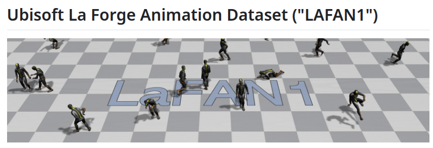
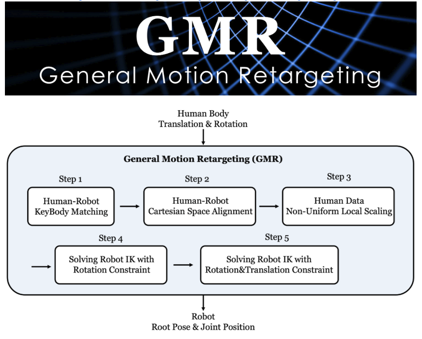
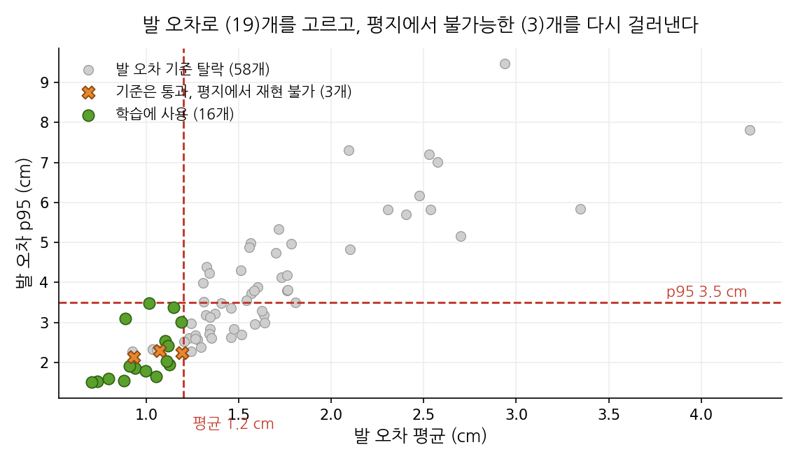
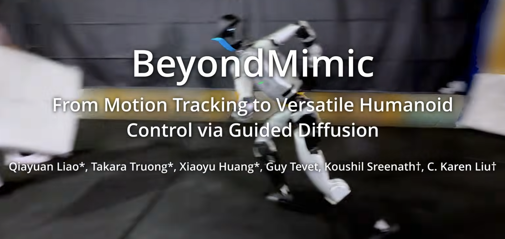
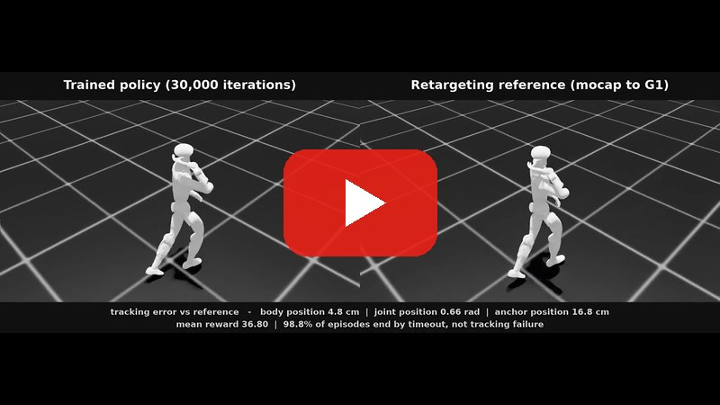
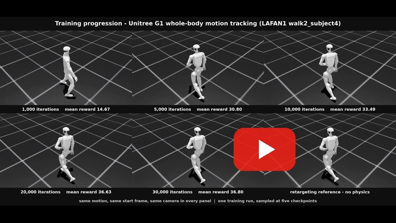
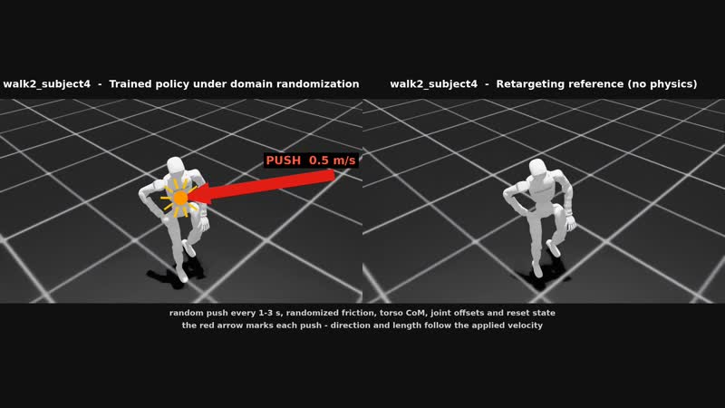
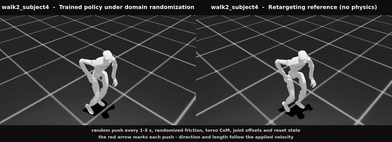
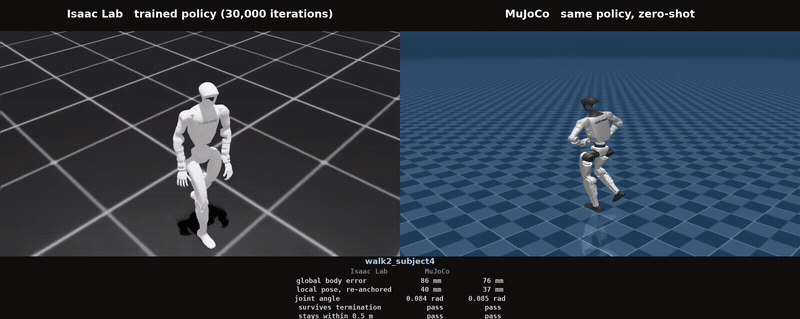

# g1-motion-tracking

사람의 모션 캡처 데이터를 Unitree G1 휴머노이드로 옮기고, 그 동작을 따라가도록
전신 제어 정책을 학습시키는 파이프라인입니다.

현재 범위는 시뮬레이션까지이며, 실제 로봇 배포는 포함하지 않습니다.

English documentation: [README.en.md](README.en.md)

학습된 정책과 평가 결과: [Hugging Face](https://huggingface.co/hooneyskywalker/g1-motion-tracking-policies)

---

## 파이프라인


1~3단계에는 물리가 없습니다. 자세를 계산하고 그중 쓸 것을 고르는 구간입니다.
물리는 4단계에서 들어오고, 거기서부터 로봇이 스스로 버텨야 합니다.

### 1단계. 사람 모션 캡처 데이터



사람 몸의 관절이 매 순간 어디에 있었는지를 숫자로 기록한 데이터입니다.
영상이 아니라 "0.1초 시점에 왼쪽 무릎은 여기, 오른쪽 팔꿈치는 여기" 같은
좌표의 나열입니다.

진행 상황: LAFAN1 77개 시퀀스를 확보했습니다. 30 fps bvh, 배우 5명, 4.6시간입니다.

### 2단계. 리타게팅



사람 기준의 관절값을 G1에 그대로 쓸 수는 없습니다. 팔다리 길이가 다르고,
관절이 꺾이는 축도 다르며, 사람에게 있는 관절이 로봇에는 없기도 합니다.
그래서 "어깨 각도 몇 도"를 복사하는 대신, 손끝과 발끝 위치처럼 지켜야 할
것을 정해 두고 그것을 최대한 만족하는 로봇 관절값을 최적화로 찾습니다.
로봇의 관절 한계를 넘지 않아야 하고, 발이 바닥을 뚫거나 뜨지 않아야 합니다.


주황색이 원본 사람 골격, 회색이 리타게팅된 G1입니다. 위아래 띠에 이 작업을
어렵게 만드는 팔다리 길이 차이와, 로봇의 각 부위가 IK 목표에서 몇 cm
떨어졌는지를 같이 넣었습니다. 이 영상에서 로봇이 걷고 있는 것은 아닙니다.
매 프레임 관절값을 모델에 직접 써넣고 그린 것이고, 시뮬레이션 스텝은
한 번도 돌지 않았습니다.

진행 상황: [GMR](https://github.com/YanjieZe/GMR)로 77개 전부 리타게팅했습니다.
총 496,672 프레임입니다. 전수 검증했습니다. NaN이나 무한대 없음, 29개 관절
어디에도 한계 위반 없음, 프레임 수는 원본 bvh와 정확히 일치합니다.

### 3단계. 레퍼런스 모션



리타게팅 결과가 로봇이 따라가야 할 목표 궤적이 됩니다. 이 단계까지는
아직 로봇이 실제로 움직인 것이 아니라, 따라야 할 정답 동작만 만들어진
상태입니다.

리타게팅했다고 다 학습에 쓸 수 있는 것은 아닙니다. 여기서 쓰는 척도는 로봇의
각 부위가 GMR의 IK가 겨냥한 목표에서 몇 cm 떨어졌는지입니다. 골반과 양 발목,
양 손목만 봅니다. 몸통과 어깨, 고관절은 위치 가중치가 0~5라 GMR이 위치를
맞추지 않고, MuJoCo 바디 원점이 사람 관절 중심과 달라 상수 오프셋이 섞입니다.

동작 종류별 발 오차입니다. 단위는 cm입니다.

```
walk         12개  1.00      obstacles      17개  1.65
dance         8개  1.25      sprint          2개  1.67
aiming        5개  1.27      fallAndGetUp    6개  2.11
run           4개  1.33      ground          5개  2.76
```

걷기가 가장 깨끗하고 바닥 동작이 가장 나쁩니다. 세 배 차이입니다. 넘어지고
눕는 동작은 발 말고도 닿는 부위가 많은데, 발에 가중치를 둔 IK는 그런 상황을
상정하지 않습니다. 손 오차는 동작 종류와 무관하게 5~9 cm입니다. 개별 동작의
실패가 아니라 팔 길이 차이라서 선별 기준으로는 쓰지 않습니다.

진행 상황: 발 오차 세 조건을 모두 만족하는 19개를 골랐습니다. 평균 1.2 cm
미만, p95 3.5 cm 미만, 최대 10 cm 미만입니다. 목록은
[`configs/selected_motions.txt`](configs/selected_motions.txt)에 있습니다.
각각을 BeyondMimic이 읽는 50 fps npz로 변환했습니다. 이 변환이 정책 학습에
필요한 링크 속도를 만들어냅니다. 변환 결과는 W&B registry에 올렸습니다.

문턱값 자체는 원칙에서 나온 것이 아닙니다. 19개가 남는 지점을 골랐고, GMR
논문이 21개로 실험한 것과 비슷한 규모라는 게 근거입니다. 학습을 돌려 실패하는
시퀀스가 어느 오차대에 몰리는지 보면 그때는 근거 있는 문턱을 정할 수 있습니다.

### 4단계. 모션 트래킹 정책 학습



강화학습으로 로봇이 그 목표를 따라가게 만듭니다. 레퍼런스 모션에 가까우면
점수를 주고, 벗어나거나 넘어지면 점수를 깎습니다. 이 과정을 반복해 로봇이
찾아낸 조종 방법이 정책(policy)이고, 점수 규칙이 보상(reward)입니다.
평가 기준은 "그럴듯하게 걷는가"가 아니라 "레퍼런스를 얼마나 정확히
따라갔는가"입니다.

학습에는 [BeyondMimic](https://github.com/HybridRobotics/whole_body_tracking)을
씁니다. GMR 논문이 정책 학습에 쓴 것과 같습니다. 모션 하나당 정책 하나를
학습하므로 19개 시퀀스는 학습 19회를 뜻합니다. 환경 4096개, 30000회 반복, PPO입니다.

그 저장소는 IsaacSim 4.5, IsaacLab 2.1.0 기준입니다. 로컬의 IsaacSim 5.1,
IsaacLab 2.3.2, rsl-rl 3.1.2에서 돌리려면 인터페이스 세 곳을 고쳐야 합니다.
학습 로직과는 무관합니다. `csv_to_npz.py`가 저장 뒤에도
`while simulation_app.is_running()` 루프를 빠져나오지 않아 `--headless`에서
끝나지 않는 것, `isaaclab.utils.io`에서 `dump_pickle`이 사라진 것, rsl-rl 3.x가
정규화기를 러너에서 정책 안으로 옮긴 것입니다.

학습한 정책을 재생하려면 같은 저장소의 `scripts/rsl_rl/play.py`에서 두 곳을
더 고쳐야 합니다. `--motion_file`이 W&B 분기에서만 읽혀 로컬 체크포인트로
돌리면 레퍼런스 모션이 비고, `get_observations()`가 반환하는 TensorDict를
기존 튜플 언패킹이 배치 차원으로 쪼개 관측이 1차원이 됩니다.

진행 상황: 첫 정책 walk2_subject4를 30000회까지 학습했습니다. RTX 5080에서
8시간 38분 걸렸습니다.


위 이미지는 그중 6초입니다. 전체 길이는 3분 58초입니다.

### ▶ 전체 영상 (YouTube)

[](https://youtu.be/l1M4y_Nl7oc)

위 이미지를 누르면 YouTube에서 재생됩니다 — https://youtu.be/l1M4y_Nl7oc

왼쪽이 물리 위에서 도는 학습된 정책, 오른쪽이 따라가야 할 레퍼런스입니다.
두 화면 모두 Isaac Sim이고 조명과 카메라가 같으며, 같은 모션 프레임에서
시작해 11,909 프레임 전체를 돌립니다. 두 화면이 픽셀 단위로 겹치지는
않습니다. 리셋마다 초기 자세에 랜덤이 들어가고, 왼쪽 로봇은 스스로 버텨야
하는 반면 오른쪽은 프레임마다 자세를 써넣은 것이기 때문입니다.

### ▶ 학습 경과 (YouTube)

[](https://youtu.be/qQw8PtmXV9s)

위 이미지를 누르면 YouTube에서 재생됩니다 — https://youtu.be/qQw8PtmXV9s

같은 학습의 체크포인트 다섯 개와 레퍼런스를 한 화면에 놓은 것입니다. 모션과
시작 프레임, 카메라가 모두 같습니다. 평균 보상은 1,000회에서 14.67,
5,000회 30.80, 10,000회 33.49, 20,000회 36.63, 30,000회 36.80입니다. 상승분
대부분이 앞쪽에서 나오고, 뒤로 갈수록 숫자보다 얼마나 오래 버티는지에서
갈립니다.

### ▶ 도메인 랜덤화 (YouTube)

[](https://youtu.be/d61rKk675qY)

위 이미지를 누르면 YouTube에서 재생됩니다 — https://youtu.be/d61rKk675qY



위는 그중 6초입니다. 왼쪽이 도메인 랜덤화를 켠 조건에서 도는 정책, 오른쪽이
레퍼런스입니다. 1~3초마다 무작위로 밀치고, 마찰과 몸통 무게중심, 관절 오프셋,
리셋 자세에도 랜덤이 들어갑니다.

밀치기는 몸통 속도에 값을 더하는 이벤트라 그대로 두면 화면에 아무것도 보이지
않습니다. 그래서 값이 들어간 순간 맞은 지점에 표시를 찍고, 미는 방향으로
화살표를 그리고, 더해진 속도를 함께 적었습니다. 화살표는 1초 동안 남습니다.

랜덤화를 켜면 정책이 레퍼런스에서 벗어나거나 에피소드가 끊길 수 있습니다.
그때는 0프레임부터 다시 시작하므로 좌우 위상이 어긋납니다. 그것도 결과의
일부입니다.

### 평가 기준

정책을 재는 방식은 GMR 논문([arXiv:2510.02252](https://arxiv.org/abs/2510.02252))을
따릅니다. 같은 데이터셋과 같은 학습 프레임워크를 쓰는 연구라 수치를 나란히
놓을 수 있습니다.

| 지표 | 뜻 |
| --- | --- |
| 완주율 | 앵커 바디의 높이·방향이 임계를 넘지 않고 클립 끝까지 간 롤아웃의 비율 |
| E_g-mpbpe | 전역 좌표에서 바디 위치 오차의 평균 (mm) |
| E_mpbpe | 앵커 기준으로 정렬한 상대 바디 위치 오차의 평균 (mm) |
| E_mpjpe | 관절 각도 오차의 평균 (rad) |

측정은 `scripts/eval_all.sh`가 하고, 표는 `src/eval_table.py`가 만듭니다.
도메인 랜덤화를 끈 조건이 기본이고 `--randomize`로 켤 수 있습니다. 논문이
sim과 sim-dr을 나눠 보고하는 방식과 같습니다.

선별한 19개 중 17개를 30,000 iteration까지 학습하고 롤아웃 100회로 평가했습니다.
발 오차와 완주율을 나란히 놓아, 리타게팅 품질이 정책이 버티는지를 예측하는지
봅니다.

| 시퀀스 | 발 오차 (cm) | 완주율 | E_g-mpbpe (mm) | E_mpbpe (mm) | E_mpjpe (rad) |
| --- | --- | --- | --- | --- | --- |
| walk4_subject1 | 0.88 | 100% | 60 | 37 | 0.062 |
| walk3_subject2 | 0.99 | 100% | 79 | 34 | 0.071 |
| walk1_subject2 | 1.05 | 100% | 79 | 34 | 0.066 |
| walk3_subject5 | 1.11 | 100% | 85 | 36 | 0.082 |
| aiming1_subject1 | 0.74 | 100% | 89 | 35 | 0.080 |
| walk1_subject5 | 1.12 | 100% | 90 | 34 | 0.069 |
| dance2_subject3 | 0.94 | 100% | 103 | 45 | 0.104 |
| walk2_subject1 | 0.91 | 100% | 114 | 43 | 0.101 |
| walk1_subject1 | 0.80 | 99% | 80 | 34 | 0.066 |
| walk2_subject4 | 0.70 | 99% | 90 | 40 | 0.085 |
| run2_subject4 | 1.12 | 99% | 178 | 47 | 0.111 |
| jumps1_subject1 | 1.10 | 98% | 151 | 42 | 0.104 |
| obstacles3_subject3 | 1.19 | 98% | 162 | 54 | 0.101 |
| walk2_subject3 | 1.15 | 96% | 129 | 50 | 0.104 |
| walk3_subject4 | 0.88 | 0% | - | - | - |
| obstacles2_subject1 | 0.93 | 0% | - | - | - |
| walk3_subject1 | 1.01 | 0% | - | - | - |
| obstacles1_subject1 | 1.07 | 미학습 |  |  |  |
| obstacles4_subject2 | 1.19 | 미학습 |  |  |  |

완주율이 0%인 셋은 완주한 롤아웃이 없어 세 지표가 정의되지 않습니다. 대신
평균 추적 길이와 전체 롤아웃 기준 E_g-mpbpe를 적으면 이렇습니다.

| 시퀀스 | 평균 추적 길이 | 전체 롤아웃 E_g-mpbpe (mm) |
| --- | --- | --- |
| walk3_subject4 | 88% (10,862 / 12,330 프레임) | 116 |
| walk3_subject1 | 78% (9,606 / 12,330 프레임) | 112 |
| obstacles2_subject1 | 18% (2,144 / 12,204 프레임) | 368 |

발 오차 순위는 정책 성적을 예측하지 못했습니다. 완주율이 0%인 셋의 발 오차는
0.88, 0.93, 1.01 cm로 중간 대역에 있고, 발 오차가 가장 큰 축인
obstacles3_subject3(1.19 cm)은 98%로 완주합니다. E_g-mpbpe가 가장 낮은
walk4_subject1(60 mm)도 발 오차는 0.88 cm로 최상위가 아닙니다.

### 완주하지 못한 셋은 학습이 아니라 레퍼런스 문제입니다

`src/motion_defect_census.py`로 네 가지를 다시 재면 셋이 한눈에 갈립니다.

| 시퀀스 | 지면 관통 | 최대 관통 | 발 미끄럼 최대 | 공중 비율 |
| --- | --- | --- | --- | --- |
| obstacles2_subject1 | 0.9% | 4.2 cm | 0.35 m/s | 26.8% |
| walk3_subject1 | 6.0% | 7.6 cm | 1.59 m/s | 0.2% |
| walk3_subject4 | 4.3% | 4.8 cm | 1.08 m/s | 0.2% |
| walk1_subject1 (완주) | 0.0% | 0.4 cm | 0.90 m/s | 0.0% |

`obstacles2_subject1`은 프레임의 26.8%가 공중입니다. 배우가 계단을 오르는
구간이라 평지에서는 발이 닿을 지면이 없습니다. 나머지 둘은 발이 지면을
파고듭니다. 완주하는 `walk1_subject1`은 관통이 0%입니다.

즉 정책이 못 따라간 것이 아니라 따라갈 수 없는 목표를 준 것입니다. 선별
기준이 발 오차 하나였고, 그 기준으로는 이 셋이 중간 대역이라 통과했습니다.
지면 관통과 공중 비율은 보지 않았습니다.

### 같은 재료로 96~100%를 받은 연구는 두 가지를 더 했습니다

Retargeting Matters([arXiv:2510.02252](https://arxiv.org/abs/2510.02252))는
같은 LAFAN1, 같은 G1, 같은 BeyondMimic으로 sim 100회에서 96~100%를
보고합니다. 논문이 그 차이를 직접 적어두었습니다.

첫째, 문제가 되는 동작을 애초에 넣지 않습니다.

> We do not include motions with complex interaction with the environment,
> such as crawling or getting up from the floor

이 저장소가 완주하지 못한 셋이 정확히 그 부류입니다.

둘째, 관통을 측정해 보정합니다.

> We fix this by running forward kinematics on the retargeted sequences,
> storing the minimum body height at each frame, and then offsetting the
> entire motion by the mean minimum body height

이 저장소는 둘 다 하지 않았습니다. 정책 쪽 차이가 아니라 3단계에서 갈린
차이입니다.

---

---

## sim-to-sim — 다른 시뮬레이터에서도 되는가

학습한 시뮬레이터에서만 도는 정책은 아무것도 증명하지 못합니다. 같은 onnx
액터를 그대로 MuJoCo에 올려, 재학습도 미세조정도 없이 17개 시퀀스를 모션 전체
길이로 다시 돌렸습니다.

판정 기준은 하나가 아닙니다. 계보마다 다르고 재는 것도 다릅니다. 그래서 같은
롤아웃을 두 기준으로 각각 채점했습니다. `src/score_standard.py`가 그 일을 합니다.

BeyondMimic 계열은 종료 조건으로 봅니다
(`tracking_env_cfg.py` 255-275). 셋 중 하나라도 걸리면 그 시점에 끝납니다.

| 조건 | 식 | 문턱 |
| --- | --- | --- |
| anchor_pos | \|ref_anchor_z − rob_anchor_z\| | 0.25 |
| anchor_ori | \|ref_gravity_z − rob_gravity_z\| | 0.8 |
| ee_body_pos | 발목·손목 4곳 중 \|ref_rel_z − rob_z\| | 0.25 |

PolySim([arXiv:2510.01708](https://arxiv.org/abs/2510.01708)) 계열은 전역 바디
위치 오차의 평균이 한 번이라도 0.5 m를 넘으면 실패로 봅니다.

세 종료 조건이 전부 z 성분만 봅니다. 수평 표류를 보지 않습니다. 반대로
PolySim 기준은 그것을 정면으로 잡습니다. 두 기준이 다른 것을 재고 있습니다.

같은 17개 롤아웃을 두 기준으로 채점하면 이렇습니다.

| 기준 | 성공 |
| --- | --- |
| BeyondMimic 종료 조건 | 14 / 17 |
| PolySim 0.5 m | 11 / 17 |

`jumps1_subject1`, `run2_subject4`, `walk2_subject3`이 갈립니다. 끝까지
넘어지지 않았지만 레퍼런스에서 0.5 m 넘게 벗어난 구간이 있습니다.

주의할 점이 하나 있습니다. PolySim 논문 본문은 평균 바디 오차 0.5 m라고
적었지만, 공개 코드는 바디 하나라도 커리큘럼 임계값(기본 1.5 m)을 넘는지를
보고 기본 설정에서는 그 판정이 꺼져 있습니다. 위 숫자는 논문 문구를 구현한
것입니다.



위는 walk2_subject4의 6초입니다. 왼쪽이 Isaac Lab, 오른쪽이 같은 정책을 올린
MuJoCo입니다. 두 화면은 같은 순간에서 시작해 같은 순간에 끝납니다.

### 자세는 넘어가고 위치는 안 넘어갑니다

walk1_subject1의 13,064 프레임 전체에서 관절 각도 오차의 평균은 Isaac 0.064 rad,
MuJoCo 0.065 rad입니다. 두 쪽 레퍼런스는 프레임 단위로 0.000000 일치합니다.
자세는 사실상 손실 없이 넘어갑니다.

넘어가지 않는 것은 위치입니다. 전역 오차의 72%가 루트의 수평 표류이고, 그
표류는 보폭이 모자라서가 아니라 진행 방향이 어긋나서 생깁니다. 로봇은 맞는
거리를 조금 틀어진 방향으로 걷고, 그 차이가 시간에 따라 벌어집니다. 같은
표류가 Isaac에서도 나타나므로 MuJoCo의 문제가 아닙니다.

### 완주하지 못한 여섯 개

17개 중 11개가 전체 길이를 완주합니다. 나머지 여섯은 모두 설명됩니다. 셋은
LAFAN1 클립 후반부에 배우가 앉거나 눕는 구간이 있는 것으로, 선별 기준이 그것을
보지 않았습니다. 그 구간이 시작되는 지점에서 자르면 셋 다 완주합니다. 둘은
전체 프레임의 0.7%와 2.5% 동안만 임계를 벗어났다가 돌아옵니다. 하나는 아직
수렴까지 학습하지 않았습니다.

시퀀스당 결정론 1회로는 표본이 모자라, 초기 관절각과 루트 자세에 잡음을 준
10시드로 다시 돌려 170 롤아웃을 얻었습니다. 14개는 1회 결과와 같고, 셋만
다릅니다. jumps1_subject1은 1회로 재면 0%인데 실제로는 30%입니다.

전체 표는 `outputs/metrics/sim2sim_full_table.md`에 있습니다.

### 외란을 같은 조건으로 주면

밀치기를 양쪽에 같은 분포, 같은 1~3초 간격으로 주면 성공률은 MuJoCo 0.182,
Isaac 0.202이고 두 쪽의 상관은 0.965입니다. 같은 MuJoCo 롤아웃을 Isaac 자체
종료 조건으로 다시 채점하면 0.769가 나옵니다. 어느 시뮬레이터를 쓰는가보다
어느 판정 기준을 쓰는가가 숫자를 네 배쯤 더 움직입니다.

여기서 조건 하나를 맞추는 데 시간이 걸렸습니다. Isaac은 밀치기를
`root_vel_w`, 즉 월드 프레임 6차원에 더합니다. MuJoCo 자유관절의 `qvel`은
선속도가 월드이고 각속도가 바디 로컬이라, 같은 6차원 벡터를 그대로 더하면
서로 다른 실험이 됩니다. 각속도만 월드에서 바디로 돌려야 같은 조건이 됩니다.

### 성공률은 얼마나 오래 재느냐에 달려 있습니다

같은 170 롤아웃을 평가 지평만 바꿔가며 다시 채점하면 이렇습니다.

| 지평 (초) | 대상 시퀀스 | 롤아웃 | 성공률 |
| --- | --- | --- | --- |
| 5 | 17 | 170 | 0.976 |
| 20 | 17 | 170 | 0.924 |
| 120 | 17 | 170 | 0.859 |
| 180 | 15 | 150 | 0.840 |
| 240 | 10 | 100 | 0.520 |
| 261 | 3 | 30 | 0.967 |

마지막 줄이 올라가는 것은 개선이 아닙니다. 261초까지 가는 클립이 17개 중
셋뿐이고 그 셋이 마침 살아남은 것들입니다. 지평을 늘릴수록 대상 코호트 자체가
바뀝니다. 클립 길이가 난이도와 얽힌 것은 아닙니다. 모든 클립에 공통인 131초
창에서 잰 평균 오차와 클립 길이의 상관은 +0.068입니다.

### 코드

지표 정의도 맞췄습니다. 상대 오차를 처음에는 각자의 골반을 빼서 냈는데, Isaac
쪽은 torso_link를 앵커로 잡고 yaw까지 재정렬한 `body_pos_relative_w`를 씁니다
(`commands.py` 284-294). 서로 다른 양이라 나란히 놓을 수 없었습니다. 같은
롤아웃에서 골반만 뺀 값이 22.1 mm, 정의를 맞춘 값이 30.5 mm입니다.

| 파일 | 하는 일 |
| --- | --- |
| `src/sim2sim.py` | onnx 액터를 MuJoCo에서 돌립니다 |
| `src/score_standard.py` | 같은 롤아웃을 두 기준으로 채점합니다 |
| `src/sim2sim_polysim.py` | PolySim의 다섯 지표를 계산합니다 |
| `src/sim2sim_trials.py` | 시퀀스마다 N회 시행해 성공률을 냅니다 |
| `src/sim2sim_push.py` | 양쪽에 같은 조건으로 밀치기를 줍니다 |
| `src/horizon_trials.py` | 시행마다 오차 시계열을 통째로 남깁니다 |
| `src/horizon_curve.py` | 평가 지평을 쓸어 성공률 곡선을 냅니다 |
| `src/sim2sim_full_table.py` | 위 표를 만듭니다 |
| `scripts/make_video_pair.sh` | 두 화면을 같은 순간에 맞춰 렌더합니다 |

---

## 폴더 구조

```
src/       리타게팅·지표·렌더·표 생성 코드
scripts/   배치 실행 스크립트
configs/   선별 목록·학습 순서
docs/      이 문서에 쓰는 그림
outputs/   생성 결과 (gitignored)
data ->    데이터 심볼릭 링크 (gitignored)
```

| 스크립트 | 하는 일 |
| --- | --- |
| `scripts/retarget_all.sh` | LAFAN1 77개를 G1으로 리타게팅 |
| `scripts/build_youtube_memo.py` | 시퀀스별 유튜브_메모.md 재조립 |
| `scripts/quality_all.sh` | 시퀀스별 IK 목표 추적 오차 측정 |
| `scripts/render_compare.sh` | 사람 골격과 로봇을 한 영상에 렌더 |
| `scripts/npz_all.sh` | 선별한 시퀀스를 npz로 변환해 registry에 업로드 |
| `scripts/train_chain.sh` | 시퀀스를 순서대로 하나씩 학습 |
| `scripts/eval_all.sh` | 학습된 정책의 완주율과 추적 오차 측정 |
| `scripts/render_tracking.sh` | 학습된 정책과 레퍼런스를 좌우로 렌더해 합성 |
| `scripts/make_pipeline_figure.py` | 이 문서의 파이프라인 그림 생성 |
| `src/eval_table.py` | 평가 결과를 발 오차 옆에 놓아 표로 만듦 |

## 데이터

모션 데이터는 수십 기가바이트라 저장소에 포함하지 않습니다.
로컬의 `/home/sehoon/data` 아래에 두고 `data` 심볼릭 링크로 접근합니다.

### 주 입력 — LAFAN1

리타게팅의 입력으로 [LAFAN1](https://github.com/ubisoft/ubisoft-laforge-animation-dataset)을
사용합니다. 4.6시간, 77개 시퀀스, 5명, 30 fps BVH 형식입니다. 규모가 더 큰
후보들 대신 선택한 이유는 세 가지입니다.

1. 형식. BVH는 사용할 리타게팅 도구가 그대로 받으므로, 중간에 몸 모델을
   맞추는 변환 단계가 필요 없습니다.
2. 비교 가능성. 선행 연구가 LAFAN1의 21개 시퀀스에 대해 네 가지 리타게팅
   방법의 추적 성공률을 공개했습니다. 따라서 결과를 주장하는 대신 알려진
   수치와 대조할 수 있습니다.
3. 동작의 폭. 5초에서 2분까지 이어지며 걷기·회전부터 격투·춤까지 포함해,
   리타게팅이 감당하는 구간과 깨지는 구간을 나누어 볼 수 있습니다.

[공식 저장소](https://github.com/ubisoft/ubisoft-laforge-animation-dataset/blob/master/lafan1/lafan1.zip)에서
`lafan1.zip`을 받아 `data/lafan1`에 풉니다. bvh 77개가 그 아래 평평하게 놓입니다.

### 참고용 — 이미 리타게팅된 G1 모션

이들은 G1으로 리타게팅이 이미 끝난 결과물입니다. 입력도 아니고 정답지도
아닙니다. 다른 방법의 출력이므로, 관절각을 맞대어 보면 두 방법이 얼마나
갈리는지가 나올 뿐 어느 쪽의 오차인지는 알 수 없습니다. 눈으로 참고하는
용도로만 둡니다.

| 데이터셋 | 내용 | 로컬 경로 |
| --- | --- | --- |
| lvhaidong/LAFAN1_Retargeting_Dataset | LAFAN1을 G1으로 리타게팅한 결과 | `data/lafan1_g1_ref` |
| bones-studio/seed | Vicon 모션 142,220개, 사람과 G1 양쪽 | `data/bones_seed` |

SEED는 나중을 위해 보류합니다. LAFAN1보다 크고 배우의 실측 신체 치수가 함께
제공되지만, 사람 쪽 데이터가 자체 형식이라 리타게팅 도구와 호환되는지
확인되지 않았고 공개된 비교 기준도 없습니다. 파이프라인이 돌아간 뒤에
쓸모가 생깁니다.

AMASS는 규모가 비교 가능성보다 중요해지는 학습 단계에서 사용합니다.

## 도구

| 도구 | 역할 |
| --- | --- |
| [GMR](https://github.com/YanjieZe/GMR) | 사용 중인 리타게팅 도구. MIT, LAFAN1 bvh를 받아 G1 관절각을 낸다 |
| Isaac Sim 5.1 / Isaac Lab 2.3.2 | 레퍼런스 모션 재생, 4단계 강화학습 |

리타게팅 자체는 물리 시뮬레이션이 필요 없는 기구학 문제입니다.
시뮬레이터는 레퍼런스 모션 재생과 정책 학습 단계에서 사용합니다.

## 배경

리타게팅 품질을 별도의 문제로 다루는 근거는 Retargeting Matters: General
Motion Retargeting for Humanoid Motion Tracking([arXiv:2510.02252](https://arxiv.org/abs/2510.02252))입니다.
리타게팅 결과에 남은 결함, 즉 발 미끄러짐·자기 충돌·물리적으로 불가능한
자세가 그것으로 학습한 추적 정책의 안정성을 떨어뜨린다는 것을 보였습니다.

### kobe — PolySim 표 옆에 놓기

위 17개는 LAFAN1이라 PolySim 논문의 표와 직접 맞댈 수 없습니다. 같은 모션으로
같은 지표를 내야 나란히 놓입니다. ASAP 데이터셋의 kobe 모션 하나를
`src/asap_to_csv.py`로 변환해 같은 파이프라인에 태웠습니다. 206프레임, 4.1초입니다.

| | PolySim 표 III | 이 저장소 |
| --- | --- | --- |
| 조건 | IsaacSim_DR → MuJoCo | Isaac Lab → MuJoCo |
| MuJoCo 성공률 | 0.100 (10회 시행) | 1.000 (10회 시행) |
| E_g-mpjpe | 272.6 mm | 100.4 mm |

같은 롤아웃을 이 저장소의 두 기준으로 채점하면 이렇습니다.

| | Isaac Lab | MuJoCo |
| --- | --- | --- |
| 전역 바디 오차 | 94.9 mm | 94.5 mm |
| 재정렬 상대 오차 | 44.5 mm | 43.8 mm |
| 관절 각도 | 0.070 rad | 0.069 rad |
| 종료 조건 통과 | pass | pass |
| 0.5 m 이내 유지 | pass | pass |

전역 오차가 94.9에서 94.5 mm로 갑니다. 전이 손실이 사실상 없습니다.

세 번 학습한 끝에 나온 값입니다. 앞의 두 번은 csv 관절 순서를 URDF가 아닌
Isaac 순서로 쓴 것(`error_joint_pos` 2.44 rad)과 레퍼런스가 지면에서 떠 있던
것 때문에 수렴하지 않았습니다.

비교에 조건이 붙습니다. 학습기와 창 길이, 표본이 논문과 다릅니다. PolySim의
성공 판정은 본문과 공개 코드가 다르기도 합니다. 같은 모션과 같은 지표 정의까지가
맞춰진 부분입니다.

## 남은 일

순서는 의존 관계를 따릅니다. 1과 2가 3의 대상을 바꿉니다.

1. 선별을 다시 합니다. 지금 19개는 발 오차로 골랐는데 그 기준이 정책 성적을
   예측하지 못했습니다. 리타게팅한 77개 전체에 `src/motion_defect_census.py`를
   돌려 지면 관통·공중 비율·발 미끄럼·관절속도 위반으로 다시 고릅니다.
2. 관통을 보정합니다. 순기구학으로 프레임마다 최저 높이를 재서 모션 전체를
   그만큼 올립니다. Retargeting Matters가 하는 방식입니다. 지금 완주하지 못하는
   둘이 여기서 살아날 수 있습니다.
3. 남은 둘을 학습합니다. obstacles1_subject1과 obstacles4_subject2입니다.
   1과 2를 거치면 대상 자체가 바뀝니다.
4. Isaac 쪽을 두 기준으로 잽니다. 지금 두 기준 표는 MuJoCo만 채워져 있습니다.
   `scripts/gt_dump_all.sh`가 17개의 프레임별 전역 오차를 남기면 네 칸이 다 찹니다.

## 진행 상황

1~3단계는 끝났습니다. 4단계는 선별한 19개 중 17개를 30,000 iteration까지
학습하고 롤아웃 100회로 평가했습니다. 남은 둘은 obstacles1_subject1과
obstacles4_subject2입니다.

평가 코드는 만들었습니다. BeyondMimic 저장소에는 `train.py`와 `play.py`만
있고 정책이 참조를 끝까지 완주하는지 세는 코드가 없어, 완주율과 추적 오차를
재는 스크립트를 GMR 논문의 정의에 맞춰 따로 두었습니다.

sim-to-sim은 17개 전부 모션 전체 길이로 끝냈습니다. 비교 영상도 17개 다
만들었습니다. 결과는 위에 적었습니다.

지금 돌리는 것은 ASAP 데이터셋의 kobe 모션 하나입니다. 위 17개는 LAFAN1이라
PolySim 논문의 표와 직접 비교가 되지 않습니다. 같은 모션으로 같은 지표를 내야
표 III(IsaacSim_DR에서 MuJoCo로 옮겼을 때 성공 0.100, E_g-mpjpe 272.6 mm) 옆에
이 저장소의 숫자를 놓을 수 있습니다.
