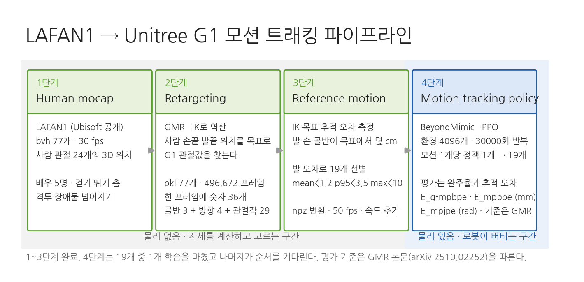
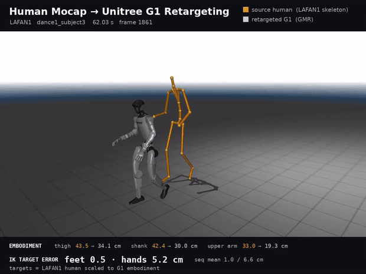
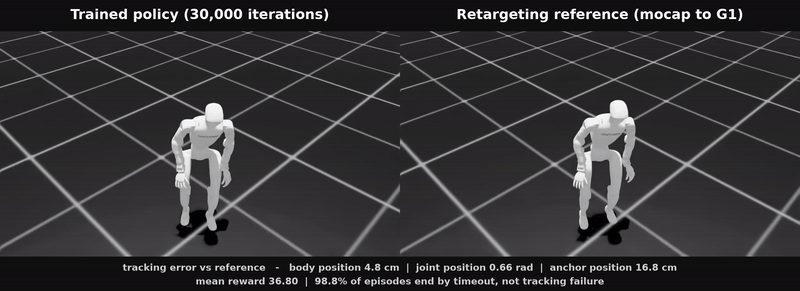

# g1-motion-tracking

Human mocap retargeting and whole-body motion tracking pipeline for the Unitree G1.

사람의 모션 캡처 데이터를 Unitree G1 휴머노이드로 옮기고, 그 동작을 따라가도록
전신 제어 정책을 학습시키는 파이프라인입니다.

Simulation only. Real-robot deployment is out of scope for now.
현재 범위는 시뮬레이션까지이며, 실제 로봇 배포는 포함하지 않습니다.

---

## Pipeline



Stages 1 to 3 carry no physics: they compute poses and decide which ones are
worth keeping. Physics enters at stage 4, where the robot has to hold itself up.

1~3단계에는 물리가 없습니다. 자세를 계산하고 그중 쓸 것을 고르는 구간입니다.
물리는 4단계에서 들어오고, 거기서부터 로봇이 스스로 버텨야 합니다.

### 1. Human mocap — 사람 모션 캡처 데이터

Motion capture records where every joint of a human body was at each instant,
as numbers rather than video.

사람 몸의 관절이 매 순간 어디에 있었는지를 숫자로 기록한 데이터입니다.
영상이 아니라 "0.1초 시점에 왼쪽 무릎은 여기, 오른쪽 팔꿈치는 여기" 같은
좌표의 나열입니다.

Done: LAFAN1, 77 BVH sequences at 30 fps, five subjects, 4.6 hours.

진행 상황: LAFAN1 77개 시퀀스를 확보했습니다. 30 fps bvh, 배우 5명, 4.6시간입니다.

### 2. Retargeting — 리타게팅

Human joint data cannot be applied to the G1 directly: link lengths differ,
joint axes differ, and some human joints have no robot counterpart. Retargeting
solves for the robot joint angles that best reproduce the original motion while
respecting the robot's joint limits and keeping the feet on the ground.

사람 기준의 관절값을 G1에 그대로 쓸 수는 없습니다. 팔다리 길이가 다르고,
관절이 꺾이는 축도 다르며, 사람에게 있는 관절이 로봇에는 없기도 합니다.
그래서 "어깨 각도 몇 도"를 복사하는 대신, 손끝과 발끝 위치처럼 지켜야 할
것을 정해 두고 그것을 최대한 만족하는 로봇 관절값을 최적화로 찾습니다.
로봇의 관절 한계를 넘지 않아야 하고, 발이 바닥을 뚫거나 뜨지 않아야 합니다.



Orange is the source human skeleton straight out of the mocap file; grey is the
retargeted G1. The bands carry the segment lengths that make this hard and the
distance between each tracked body and the target the IK was solving for. The
robot is not walking here — each frame's joint angles are written straight into
the model and rendered. No simulation step runs.

주황색이 원본 사람 골격, 회색이 리타게팅된 G1입니다. 위아래 띠에 이 작업을
어렵게 만드는 팔다리 길이 차이와, 로봇의 각 부위가 IK 목표에서 몇 cm
떨어졌는지를 같이 넣었습니다. 이 영상에서 로봇이 걷고 있는 것은 아닙니다.
매 프레임 관절값을 모델에 직접 써넣고 그린 것이고, 시뮬레이션 스텝은
한 번도 돌지 않았습니다.

Done: all 77 sequences retargeted with
[GMR](https://github.com/YanjieZe/GMR), 496,672 frames. Verified across every
frame: no NaNs or infinities, no joint-limit violations on any of the 29 joints,
frame counts matching the source BVH exactly.

진행 상황: GMR로 77개 전부 리타게팅했습니다. 총 496,672 프레임입니다.
전수 검증했습니다. NaN이나 무한대 없음, 29개 관절 어디에도 한계 위반 없음,
프레임 수는 원본 bvh와 정확히 일치합니다.

### 3. Reference motion — 레퍼런스 모션

The retargeted trajectory becomes the target the robot is asked to follow.
At this point nothing is physically simulated yet — only the goal exists.

리타게팅 결과가 로봇이 따라가야 할 목표 궤적이 됩니다. 이 단계까지는
아직 로봇이 실제로 움직인 것이 아니라, 따라야 할 정답 동작만 만들어진
상태입니다.

Not every retargeted sequence is worth training on. The measure used here is how
far each tracked body ends up from the target GMR's IK was solving for. Only
pelvis, ankles and wrists are read: torso, shoulder and hip carry position
weights of 0 to 5, and their MuJoCo body origins do not coincide with the human
joint centres, so the constant offset there is not error.

리타게팅했다고 다 학습에 쓸 수 있는 것은 아닙니다. 여기서 쓰는 척도는 로봇의
각 부위가 GMR의 IK가 겨냥한 목표에서 몇 cm 떨어졌는지입니다. 골반과 양 발목,
양 손목만 봅니다. 몸통과 어깨, 고관절은 위치 가중치가 0~5라 GMR이 위치를
맞추지 않고, MuJoCo 바디 원점이 사람 관절 중심과 달라 상수 오프셋이 섞입니다.

Foot error by motion type, in cm:

동작 종류별 발 오차입니다. 단위는 cm입니다.

```
walk         12개  1.00      obstacles      17개  1.65
dance         8개  1.25      sprint          2개  1.67
aiming        5개  1.27      fallAndGetUp    6개  2.11
run           4개  1.33      ground          5개  2.76
```

Walking is cleanest and floor work is worst, by a factor of three. Falling and
lying down put contact on parts other than the feet, which is not what an
ankle-weighted IK is set up for. Hand error stays at 5-9 cm regardless of motion
type — that is the arm-length gap, not a per-motion failure, so it is not used
to filter.

걷기가 가장 깨끗하고 바닥 동작이 가장 나쁩니다. 세 배 차이입니다. 넘어지고
눕는 동작은 발 말고도 닿는 부위가 많은데, 발에 가중치를 둔 IK는 그런 상황을
상정하지 않습니다. 손 오차는 동작 종류와 무관하게 5~9 cm입니다. 개별 동작의
실패가 아니라 팔 길이 차이라서 선별 기준으로는 쓰지 않습니다.

Done: 19 sequences clear all three foot thresholds — mean under 1.2 cm, p95
under 3.5 cm, max under 10 cm. The list is in
[`configs/selected_motions.txt`](configs/selected_motions.txt). Each was
converted to the 50 fps npz BeyondMimic reads, which adds the link velocities
the policy needs, and uploaded to a W&B registry.

진행 상황: 발 오차 세 조건을 모두 만족하는 19개를 골랐습니다. 평균 1.2 cm
미만, p95 3.5 cm 미만, 최대 10 cm 미만입니다. 목록은
[`configs/selected_motions.txt`](configs/selected_motions.txt)에 있습니다.
각각을 BeyondMimic이 읽는 50 fps npz로 변환했습니다. 이 변환이 정책 학습에
필요한 링크 속도를 만들어냅니다. 변환 결과는 W&B registry에 올렸습니다.

The thresholds are not principled. They were picked because they leave 19
sequences, close to the 21 the GMR paper trained on. Once training shows which
sequences fail and where their error sits, the cut can be argued for.

문턱값 자체는 원칙에서 나온 것이 아닙니다. 19개가 남는 지점을 골랐고, GMR
논문이 21개로 실험한 것과 비슷한 규모라는 게 근거입니다. 학습을 돌려 실패하는
시퀀스가 어느 오차대에 몰리는지 보면 그때는 근거 있는 문턱을 정할 수 있습니다.

### 4. Motion tracking policy — 모션 트래킹 정책 학습

The robot is trained with reinforcement learning: it is rewarded for staying
close to the reference motion and penalised for drifting away or falling. The
control rule it converges on is the policy. Success is measured by tracking
accuracy, not by whether the walk merely looks plausible.

강화학습으로 로봇이 그 목표를 따라가게 만듭니다. 레퍼런스 모션에 가까우면
점수를 주고, 벗어나거나 넘어지면 점수를 깎습니다. 이 과정을 반복해 로봇이
찾아낸 조종 방법이 정책(policy)이고, 점수 규칙이 보상(reward)입니다.
평가 기준은 "그럴듯하게 걷는가"가 아니라 "레퍼런스를 얼마나 정확히
따라갔는가"입니다.

Training uses [BeyondMimic](https://github.com/HybridRobotics/whole_body_tracking),
the same framework the GMR paper used. It trains one policy per motion, so the
19 sequences mean 19 training runs. 4096 environments, 30000 iterations, PPO.

학습에는 [BeyondMimic](https://github.com/HybridRobotics/whole_body_tracking)을
씁니다. GMR 논문이 정책 학습에 쓴 것과 같습니다. 모션 하나당 정책 하나를
학습하므로 19개 시퀀스는 학습 19회를 뜻합니다. 환경 4096개, 30000회 반복, PPO입니다.

That repository targets IsaacSim 4.5 and IsaacLab 2.1.0. Running it against the
local IsaacSim 5.1 / IsaacLab 2.3.2 / rsl-rl 3.1.2 needed three interface
fixes, none of which touch the learning itself: `csv_to_npz.py` never leaves its
`while simulation_app.is_running()` loop after saving, which does not end under
`--headless`; `isaaclab.utils.io` no longer exports `dump_pickle`; and rsl-rl 3.x
moved the observation normalizer off the runner and into the policy.

그 저장소는 IsaacSim 4.5, IsaacLab 2.1.0 기준입니다. 로컬의 IsaacSim 5.1,
IsaacLab 2.3.2, rsl-rl 3.1.2에서 돌리려면 인터페이스 세 곳을 고쳐야 합니다.
학습 로직과는 무관합니다. `csv_to_npz.py`가 저장 뒤에도
`while simulation_app.is_running()` 루프를 빠져나오지 않아 `--headless`에서
끝나지 않는 것, `isaaclab.utils.io`에서 `dump_pickle`이 사라진 것, rsl-rl 3.x가
정규화기를 러너에서 정책 안으로 옮긴 것입니다.

Playing a trained policy back needs two more fixes in the same file,
`scripts/rsl_rl/play.py`. `--motion_file` is only read on the W&B branch, so a
local checkpoint starts with no reference motion, and `get_observations()` now
returns a TensorDict that the existing tuple unpacking splits along the batch
dimension, leaving a one-dimensional observation.

학습한 정책을 재생하려면 같은 저장소의 `scripts/rsl_rl/play.py`에서 두 곳을
더 고쳐야 합니다. `--motion_file`이 W&B 분기에서만 읽혀 로컬 체크포인트로
돌리면 레퍼런스 모션이 비고, `get_observations()`가 반환하는 TensorDict를
기존 튜플 언패킹이 배치 차원으로 쪼개 관측이 1차원이 됩니다.

Done: the first policy, walk2_subject4, trained to 30000 iterations in 8 h 38 m
on an RTX 5080.

진행 상황: 첫 정책 walk2_subject4를 30000회까지 학습했습니다. RTX 5080에서
8시간 38분 걸렸습니다.



Left is the trained policy stepping through physics, right is the reference it
was asked to follow. Both panels are Isaac Sim under the same lighting and
camera, start from the same motion frame, and run the full 11,909 frame
sequence. They never match pixel for pixel: the initial pose is randomised at
every reset, and the left robot has to hold itself up while the right one is
posed frame by frame.

왼쪽이 물리 위에서 도는 학습된 정책, 오른쪽이 따라가야 할 레퍼런스입니다.
두 화면 모두 Isaac Sim이고 조명과 카메라가 같으며, 같은 모션 프레임에서
시작해 11,909 프레임 전체를 돌립니다. 두 화면이 픽셀 단위로 겹치지는
않습니다. 리셋마다 초기 자세에 랜덤이 들어가고, 왼쪽 로봇은 스스로 버텨야
하는 반면 오른쪽은 프레임마다 자세를 써넣은 것이기 때문입니다.

Where it ended up, averaged over 4096 environments at iteration 30000:

30000회 시점, 환경 4096개 평균입니다.

```
링크 위치 오차     4.8 cm     추종 대상 링크 오차의 평균
관절 위치 오차     0.66 rad   29개 관절 차이의 L2 노름
앵커 위치 오차     16.8 cm    앵커 링크의 전역 위치 오차
시간 만료 종료     98.8 %     에피소드가 추종 실패 없이 끝난 비율
평균 보상          36.80
```

An episode is cut short when the anchor or an end-effector drifts past its
threshold, so 98.8 % is how often the policy carried a 10 s episode to the end
without that happening. It is measured on the motion it was trained on and is
not the same quantity as the published per-sequence success rates, which the
table below is still waiting on.

앵커나 말단 링크가 문턱을 넘으면 에피소드가 중간에 끊깁니다. 따라서 98.8%는
정책이 10초 에피소드를 끝까지 끌고 간 비율입니다. 학습에 쓴 그 모션에서 잰
값이고, 선행 연구가 공개한 시퀀스별 성공률과 같은 양이 아닙니다. 아래 표는
그 값을 기다리고 있습니다.

What the 19 runs are for is the table below — success rate against foot error,
to see whether retargeting quality predicts whether the policy holds.

19회를 돌리는 목적은 아래 표를 채우는 것입니다. 발 오차와 성공률을 나란히
놓고, 리타게팅 품질이 정책이 버티는지를 예측하는지 봅니다.

```
시퀀스                발 오차    성공률
walk2_subject4         0.70        ?   학습 완료, 성공률은 기준 확정 후
aiming1_subject1       0.74        ?
...
obstacles4_subject2    1.19        ?
```

---

## Layout

```
src/       retargeting, metrics, rendering  리타게팅·지표·렌더 코드
scripts/   batch drivers                    배치 실행 스크립트
configs/   selection and training order     선별 목록·학습 순서
docs/      figures used in this README      이 문서에 쓰는 그림
outputs/   motions, metrics, logs, videos   생성 결과 (gitignored)
data ->    symlink to local dataset root    데이터 심볼릭 링크 (gitignored)
```

| script | 하는 일 |
| --- | --- |
| `scripts/retarget_all.sh` | LAFAN1 77개를 G1으로 리타게팅 |
| `scripts/quality_all.sh` | 시퀀스별 IK 목표 추적 오차 측정 |
| `scripts/render_compare.sh` | 사람 골격과 로봇을 한 영상에 렌더 |
| `scripts/npz_all.sh` | 선별한 시퀀스를 npz로 변환해 registry에 업로드 |
| `scripts/train_chain.sh` | 시퀀스를 순서대로 하나씩 학습 |
| `scripts/render_tracking.sh` | 학습된 정책과 레퍼런스를 좌우로 렌더해 합성 |

## Data

Motion datasets run to tens of gigabytes and are not tracked in this repo.
They live under `/home/sehoon/data`, reached through the `data` symlink.

모션 데이터는 수십 기가바이트라 저장소에 포함하지 않습니다.
로컬의 `/home/sehoon/data` 아래에 두고 `data` 심볼릭 링크로 접근합니다.

### Primary source — LAFAN1

[LAFAN1](https://github.com/ubisoft/ubisoft-laforge-animation-dataset) is used
as the input to retargeting. 4.6 hours, 77 sequences, 5 subjects, BVH at 30 fps.
It was picked over the larger alternatives for three reasons:

1. Format. BVH is consumed directly by the retargeting tools in use; no
   intermediate body-model fitting step is required.
2. Comparability. Prior work has published per-sequence tracking success rates
   for four retargeting methods on a 21-sequence subset of LAFAN1, so results
   here can be placed against known numbers rather than argued for.
3. Motion range. Sequences run 5 s to 2 min and span walking and turning through
   martial arts and dance, which separates the cases retargeting handles from
   the ones it breaks on.

리타게팅의 입력으로 LAFAN1을 사용합니다. 4.6시간, 77개 시퀀스, 5명, 30 fps
BVH 형식입니다. 규모가 더 큰 후보들 대신 선택한 이유는 세 가지입니다.

1. 형식. BVH는 사용할 리타게팅 도구가 그대로 받으므로, 중간에 몸 모델을
   맞추는 변환 단계가 필요 없습니다.
2. 비교 가능성. 선행 연구가 LAFAN1의 21개 시퀀스에 대해 네 가지 리타게팅
   방법의 추적 성공률을 공개했습니다. 따라서 결과를 주장하는 대신 알려진
   수치와 대조할 수 있습니다.
3. 동작의 폭. 5초에서 2분까지 이어지며 걷기·회전부터 격투·춤까지 포함해,
   리타게팅이 감당하는 구간과 깨지는 구간을 나누어 볼 수 있습니다.

Download `lafan1.zip` from the [official repo](https://github.com/ubisoft/ubisoft-laforge-animation-dataset/blob/master/lafan1/lafan1.zip)
and unzip it into `data/lafan1`. All 77 `.bvh` files sit flat in that directory.

[공식 저장소](https://github.com/ubisoft/ubisoft-laforge-animation-dataset/blob/master/lafan1/lafan1.zip)에서
`lafan1.zip`을 받아 `data/lafan1`에 풉니다. bvh 77개가 그 아래 평평하게 놓입니다.

### Reference — already-retargeted G1 motions

These ship motions that have already been retargeted to the G1. They are not
inputs, and they are not ground truth either — they are another method's output.
Comparing joint angles against them measures how far two methods diverge, not
how much error either one carries. They are kept for qualitative reference only.

이들은 G1으로 리타게팅이 이미 끝난 결과물입니다. 입력도 아니고 정답지도
아닙니다. 다른 방법의 출력이므로, 관절각을 맞대어 보면 두 방법이 얼마나
갈리는지가 나올 뿐 어느 쪽의 오차인지는 알 수 없습니다. 눈으로 참고하는
용도로만 둡니다.

| dataset | contents | local path |
| --- | --- | --- |
| lvhaidong/LAFAN1_Retargeting_Dataset | LAFAN1 retargeted to G1 | `data/lafan1_g1_ref` |
| bones-studio/seed | 142,220 Vicon motions, human and G1 side | `data/bones_seed` |

SEED is held for later. It is larger than LAFAN1 and pairs each motion with the
capture subject's measured body dimensions, but its human-side data is in a
custom format whose compatibility with the retargeting tools is unverified, and
no published baseline exists for it. It becomes useful once the pipeline runs.

SEED는 나중을 위해 보류합니다. LAFAN1보다 크고 배우의 실측 신체 치수가 함께
제공되지만, 사람 쪽 데이터가 자체 형식이라 리타게팅 도구와 호환되는지
확인되지 않았고 공개된 비교 기준도 없습니다. 파이프라인이 돌아간 뒤에
쓸모가 생깁니다.

AMASS is deferred to the training stage, where scale matters more than
comparability.

AMASS는 규모가 비교 가능성보다 중요해지는 학습 단계에서 사용합니다.

## Tools

| tool | role |
| --- | --- |
| [GMR](https://github.com/YanjieZe/GMR) | retargeting tool in use; MIT, takes LAFAN1 BVH and outputs G1 joint angles |
| Isaac Sim 5.1 / Isaac Lab 2.3.2 | reference motion playback, and RL training in stage 4 |

Retargeting itself needs no physics simulation — it is a kinematics problem.
The simulator enters at playback and at policy training.

리타게팅 자체는 물리 시뮬레이션이 필요 없는 기구학 문제입니다.
시뮬레이터는 레퍼런스 모션 재생과 정책 학습 단계에서 사용합니다.

## Background

The premise that retargeting quality is worth treating as its own problem comes
from *Retargeting Matters: General Motion Retargeting for Humanoid Motion
Tracking* ([arXiv:2510.02252](https://arxiv.org/abs/2510.02252)), which showed that artifacts left in retargeted
trajectories — foot sliding, self-penetration, physically infeasible poses —
measurably reduce the robustness of the tracking policy trained on them.

리타게팅 품질을 별도의 문제로 다루는 근거는 Retargeting Matters: General
Motion Retargeting for Humanoid Motion Tracking(arXiv:2510.02252)입니다. 리타게팅
결과에 남은 결함, 즉 발 미끄러짐·자기 충돌·물리적으로 불가능한 자세가
그것으로 학습한 추적 정책의 안정성을 떨어뜨린다는 것을 보였습니다.

## Status

Stages 1 to 3 are done. Stage 4 is running: the first policy is training, with
the remaining 18 sequences queued behind it. Per-stage detail is above.

1~3단계는 끝났습니다. 4단계가 진행 중이고, 첫 정책을 학습하면서 나머지 18개
시퀀스가 순서를 기다리고 있습니다. 단계별 상세는 위에 적었습니다.

Not done yet: an evaluation script. The repository ships `train.py` and
`play.py` but nothing that counts whether a policy carries a reference to the
end, so success rate has to be defined and measured here.

아직 안 된 것: 평가 스크립트입니다. BeyondMimic 저장소에는 `train.py`와
`play.py`만 있고, 정책이 참조를 끝까지 완주하는지 세는 코드는 없습니다.
성공률은 여기서 정의하고 재야 합니다.
